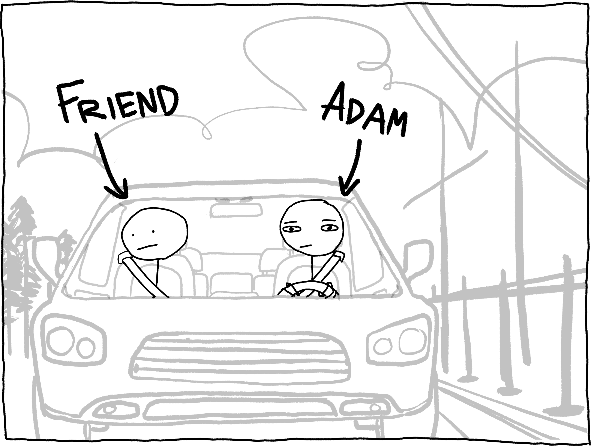

## Prologue: Sea Spray, Fear, Bears

Windows down, midday, late July. I'm driving home from the Jersey shore with a friend. Abruptly, he says to me,

[talking picture, neither looking at each other]

"Hey, did you know that, technically, you're always surrounded by bears?"

[same pic, furrowed brow]

What? That doesn't make sense. No I'm not.

[pic again]

"Yeah, if you go far enough in any direction, eventually you'll hit a place with bears. So, bears on all sides. Surrounded. Weird, right?"

[confusion pic]

Weird?

[zoom on face]

No.

[zoom with "hey, was that our exit?" and zoom in on eyes with bear reflection in them]

If this was true, it was *terrifying*.

Are you afraid of bears? Not really? You grew up on Care Bears, Yogi, and Winnie the Pooh? I envy your complacency, but you have been sedated, protected from the terrible truth by a webwork of platitudes and propaganda.[^1] Did you know that bears eat their victims alive? Did you know your entire head can fit into a bear's mouth? Did you know that bears can muster ~1000 PSI[^2] of bite pressure? Did you know *you are actually very afraid of bears*?

I sped home and pulled out my laptop, mind racing, monomaniacally determined to answer a single question: *was I really always surrounded by bears*?

## A Global Panopticon

Here are the rules:

1. The only "bear-free zones" are places where you are guaranteed to *never* find a bear. "Bear zones" are places where a bear *could* reasonably be.
2. To be "surrounded" means that walking a straight line (geodesic) in any direction, starting from you, will eventually land you in a "bear zone".
3. Your line-of-sight circles the planet: a bear a mile to your left counts as a bear 24,900 miles to your right.

This begets a simple algorithm to determine, approximately, whether or not you are surrounded by bears:

1. Pick a random azimuthal direction.
2. Extend an arc in that direction and let it extend around the entire globe (so, a [great circle](https://en.wikipedia.org/wiki/Great_circle)).
3. If that arc passes through a bear-free zone, congrats! You are not surrounded by bears.
4. Otherwise, return to step 1, or give up and accept the fact that you are surrounded by bears.

We'll optimize the ***heck*** out of this, but that's the gist. Let's get some data.

## Where are the bears?

### 1. iNaturalist Records

Occasionally, a human[^3] will see a bear in person and survive. Within this rare fraction of encounters, an even smaller fraction of humans will log the observation on [iNaturalist](https://www.inaturalist.org/observations?subview=map), a confusingly impressive platform and data hub for observations of all sorts of living flora and fauna. As I write this[^4], there are roughly [100,000 cumulative iNaturalist observations](https://www.inaturalist.org/observations?taxon_id=41636]) of the eight species within the family [*Ursidae*](https://en.wikipedia.org/wiki/Bear)*:*  bears.

Binned iNaturalist observations of *Ursidae*, visualized with [kepler.gl](https://kepler.gl/).

These observations have great coverage in the US, but they are biased towards the Western hemisphere. Additionally, they are obviously incomplete: no human dares wander into the heart of bear territory,[^5] so there will be gaps. We can accommodate for this by 'buffering' (inflating) our observations; that is, we assume that if a bear was spotted somewhere, there could be a bear anywhere within, say, 50 miles of that location.

### 2. IUCN Region Geometry

[^1]: Okay, dropping the act for a second, bears are wonderful creatures. The majority of the eight existing bear species are under threat. If you want to help them, consider making a donation to the [WWF](https://www.worldwildlife.org/) or another conservationist charity. That said, they are still *really freaking scary* when they're mad at you.

[^2]: [Polar bears](https://pmc.ncbi.nlm.nih.gov/articles/PMC2974639/), at least. [Brown bears](https://pmc.ncbi.nlm.nih.gov/articles/PMC11083096/) bite closer to 700 PSI.

[^3]: To assure you: despite the tone I take in this post, I am not a salmon.

[^4]: November 2025... as far as you know.

[^5]: Bearitory? Bearritory?