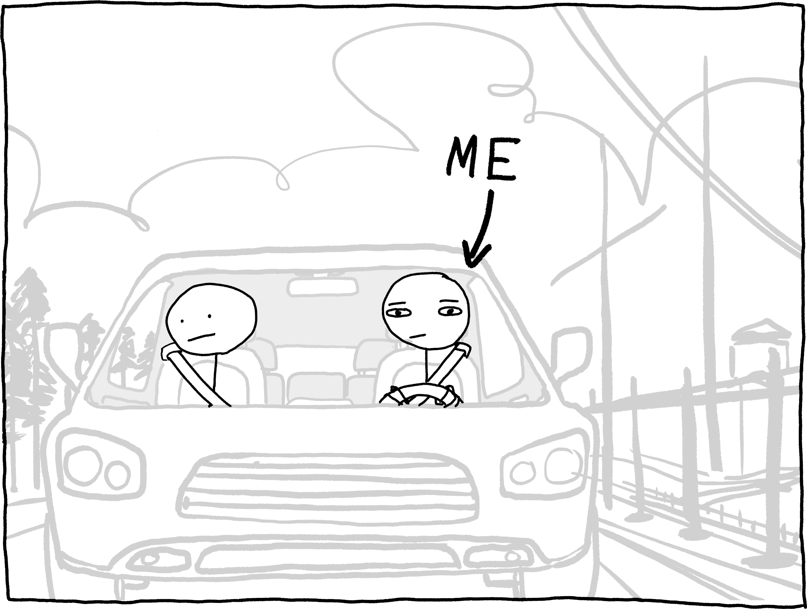
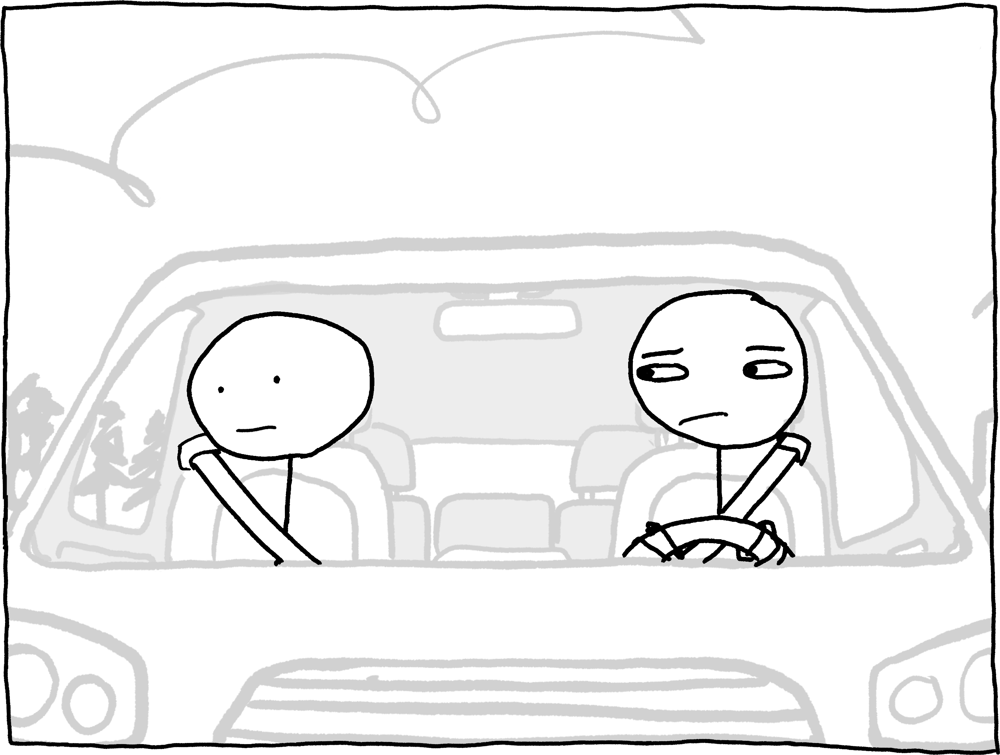
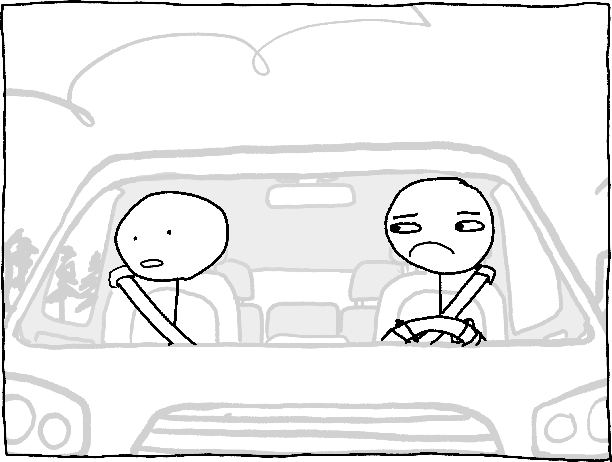
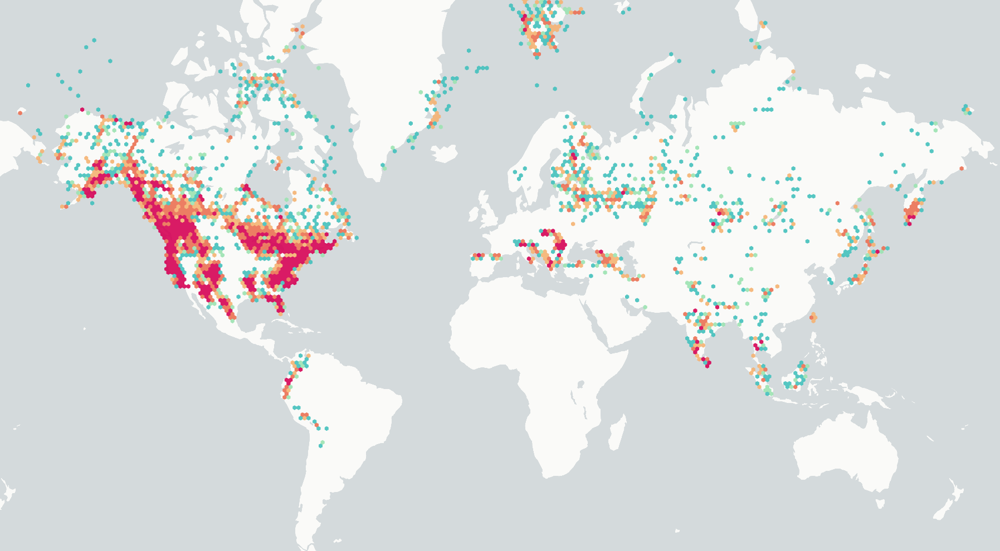

## Prologue: Sea Spray, Bears, Fear

Windows down, midday, late July. I'm driving home from the Jersey shore with a friend. Abruptly, he says to me,

"Hey, did you know that, technically, you're always surrounded by bears?"

What? That doesn't make sense. No I'm not.

"Yeah, if you go far enough in any direction, eventually you'll hit a place with bears. So, bears on all sides. Surrounded. Weird, right?"

Weird?

No.

If this was true, it was *terrifying*.

Are you afraid of bears? Not really? You grew up on Care Bears, Yogi, and Winnie the Pooh? I envy your complacency, but you have been sedated, protected from the terrible truth by a webwork of platitudes and propaganda.[^1] Did you know that bears eat their victims alive? Did you know your entire head can fit into a bear's mouth? Did you know that bears can muster ~1000 PSI[^2] of bite pressure? Did you know *you are actually very afraid of bears*?

I sped home and pulled out my laptop, mind racing, monomaniacally determined to answer a single question: *was I really always surrounded by bears*?

## A Global Panopticon

Answering it might get confusing, so I want to clearly outline a couple rules about the question. Following my friend's logic:

1. **A bear to your left is also a bear to your right.** This is because, on the Earth, if you travel far enough to your left, you *eventually*[^6] end up to the right of where you started. If you think it overcautious to heed this maxim, I encourage you to watch [this video](https://www.youtube.com/watch?v=kccJfnfFLC0) and reconsider your arrogant naivete.
2. **We don't know where the bears are.** I mean, we kind of know, but they move around. To remedy this, I am simply going to designate regions where bears *could conceivably be* "bear zones". If you are surrounded by bear zones, you might as well be surrounded by bears.
3. **We only care about being surrounded.** What's that? Your house borders a bear zone? I can recommend a good probate attorney, but I'm really focused on the big picture here. We don't care if there are bears *nearby* -- we're just trying to figure out whether or not you're *surrounded* by them.

So, to recap, if there is a direction that you can walk in (i.e. a [great circle](https://en.wikipedia.org/wiki/Great_circle) around the Earth) that doesn't pass through a bear zone, you are **Not Surrounded By Bears**.

This begets a simple process to determine, approximately, whether or not you are surrounded by bears:

1. Pick a random direction.
2. 'Walk' around the globe (programmatically, of course) in that direction, making a full loop.
3. If you didn't pass through a bear zone, good! You are not surrounded by bears.
4. If you did pass through a bear zone, either return to step 1 and try again or make peace your inevitable death.

We'll come back to this, but for now, we need to tackle an essential question: where *are* the bears, anyway?

## Where are the bears?

Taxonomically, "bear" means "member of the family *Ursidae*", which you probably shouldn't say out loud.[^7] This family contains just eight distinct species, plus the rare [crossbreeds](https://en.wikipedia.org/wiki/Ursid_hybrid). You're hopefully familiar with all eight: [American black bears](https://en.wikipedia.org/wiki/American_black_bear), [Asian black bears](https://en.wikipedia.org/wiki/Asian_black_bear), [brown bears](https://en.wikipedia.org/wiki/Brown_bear), [giant pandas](https://en.wikipedia.org/wiki/Giant_panda), [polar bears](https://en.wikipedia.org/wiki/Polar_bear), [sloth bears](https://en.wikipedia.org/wiki/Sloth_bear), [spectacled bears](https://en.wikipedia.org/wiki/Spectacled_bear), and [sun bears](https://en.wikipedia.org/wiki/Sun_bear). These species terrorize four of the seven continents, sparing only Africa, Australia, and Antarctica, whose name literally means "no bears".[^8] But of course, continents are not enough. I needed extents, coordinates, 

Like an Ursid after human flesh, I searched. I queried every database. I lurked on bear forums. I hacked them. I hacked the bears running them. I put on a musky bearskin suit and infiltrated my local bear communities. It cost me eight years of heart-shattering peril and all my grace with God to find my oracle in that mess of fur and claws, and its huge, bloody paws laid bare two divine sources:

### 1. iNaturalist Records

Occasionally, a human[^3] will see a bear in person and survive. Within this rare fraction of encounters, an even smaller fraction of humans will log the observation on [iNaturalist](https://www.inaturalist.org/observations?subview=map), a confusingly impressive platform and data hub for observations of all sorts of living flora and fauna. As I write this[^4], there are roughly [100,000 cumulative iNaturalist observations](https://www.inaturalist.org/observations?taxon_id=41636]) of the eight species within the family [*Ursidae*](https://en.wikipedia.org/wiki/Bear)*:*  bears.

Binned iNaturalist observations of *Ursidae*, visualized with [kepler.gl](https://kepler.gl/).

These observations have great coverage in the US, but they are biased towards the Western hemisphere. Additionally, they obviously *must* be incomplete: no sane human dares wander into the heart of bear territory,[^5] so there will be gaps. We can accommodate for this by 'buffering' (inflating) our observations; that is, we assume that if a bear was spotted somewhere, there could be a bear anywhere within, say, 50 miles of that location.

### 2. IUCN Region Geometry

Even though its headquarters are in a Swiss city named "Gland", the IUCN a wonderful goto international organization for everything conservation and environmental. They also publish 

[^1]: Okay, dropping the act for a second, bears are wonderful creatures. The majority of the eight existing bear species are under threat. If you want to help them, consider making a donation to the [WWF](https://www.worldwildlife.org/) or another conservationist charity. That said, they are still *really freaking scary* when they're mad at you.

[^2]: [Polar bears](https://pmc.ncbi.nlm.nih.gov/articles/PMC2974639/), at least. [Brown bears](https://pmc.ncbi.nlm.nih.gov/articles/PMC11083096/) bite closer to 700 PSI.

[^3]: To assure you: despite the tone I take in this post, I am not a salmon. Salmon can't drive cars. At least, not well.

[^4]: November 2025... as far as you know.

[^5]: Bearitory? Bearritory?

[^6]: After roughly 24,900 miles.

[^7]: The word "bear" is likely a taboo avoidance (he-who-must-not-be-named) word that materialized from "brown one" because proto-Germanic tribes were too scared to say "h₂ŕ̥tḱos" out loud. *Ursidae* is a direct descendent of the latter and retains the bulk of its bear-summoning properties.

[^8]: You might assume that the Arctic was named for its polar bears (*arktos* means "bear" in Greek), but no: it was for the Constellations Ursa Major and Ursa Minor, which God kindly placed in the Northern sky to warn proto-humans of the apex predators lumbering around the boreal hemisphere.
