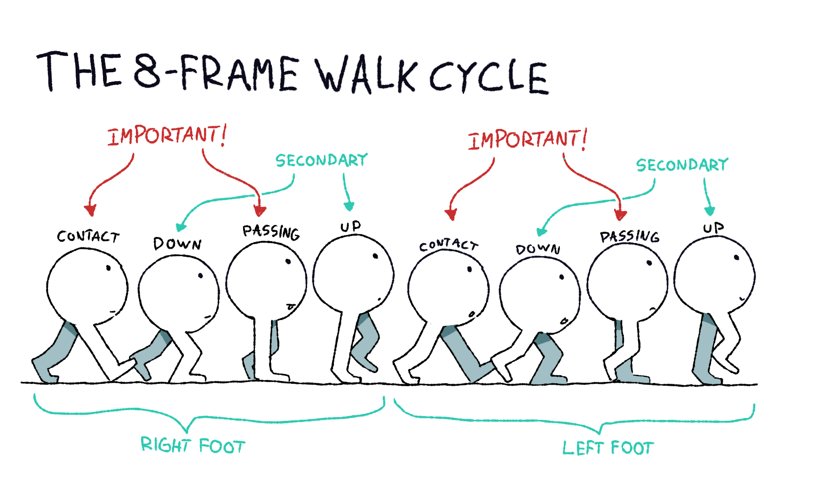
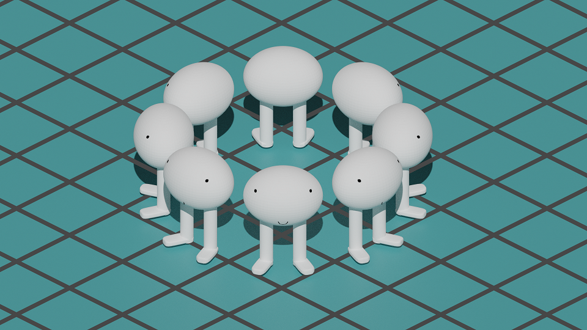

I'm making a 2D videogame with a top-down, hand-drawn artstyle. Here's an asset from it:

    </img>
    This house provides a good example of the artstyle I'm using for the game.

I'm able to draw well enough to make decent static environmental assets, like buildings, objects, and terrain. But to make a game, I need moving characters.

## The Situation

2D animation is hard.

    </img>
    Even making simple animations can be very frustrating.

Making a good-looking "walk cycle" for a character requires vast amounts of drawing skill (perspective, anatomy, consistency, etc.) and deep familiarity and experience with the principles of animation. It also requires an extraordinary amount of *patience*.

To illustrate this point, let's see the amount of work it takes to animate a character in a modern top-down RPG. I'll use a very simple example character, who I'll call Bill:

</img>

Hi, Bill.

First, let's consider every possible direction Bill can move in. While older RPGs limited movement to just four directions (N, W, S, E), newer titles like [Hyper Light Drifter](https://www.heartmachine.com/hyper-light-drifter) or [Bastion](https://www.supergiantgames.com/games/bastion/) allow their characters to move in eight directions (N, NW, W, SW, S, SE, E, NE). This has become the norm for top-down games with keyboard input, so let's say Bill can move in these eight directions:

</img>

We can cheat a little bit here: Because Bill is symmetrical, all images of him facing left are simply mirror images of him facing right. This means we only need to animate 5/8 of the possible directions because we can get the rest by symmetry:

</img>

Next, we need walk cycles for these five directions It takes 4 frames to make a readable walk cycle (2 frames / step), and 8 to make a half-decent one (4 frames / step). I'll use eight in this example because it's what I'm doing in my game:

</img>

So, for each of the five directions, we need an eight-frame walk cycle plus a single frame of bill standing still:

</img>

However, we can exploit Bill's symmetrical design even more; for the N and S directions, Bill's left-foot step exactly mirrors his right. That cuts out a few more frames:

</img>

Ultimately, we are left with 37 frames to draw (72 if Bill is asymmetric). That's 37 rounds of sketching, inking, coloring, and shading, all for just one character.

*This is a lot of work.*

Furthermore, to make these drawings, you also need to be able to accurately render the same exact motion from five different angles. After a few attempts, I quickly realized I wasn't skilled enough to do this well. I didn't have the funds to hire an animator, so I turned to other methods.

## The "Hack"

Occasionally, a question that seems impossibly difficult and tedious to answer can be *transformed* into a much simpler one. Each field has its own quintessential transformations: differential equations have the [Laplace transform](https://en.wikipedia.org/wiki/Laplace_transform), electrical networks have the [star-mesh transform](https://en.wikipedia.org/wiki/Star-mesh_transform), and formal logic has [proof by contradiction](https://en.wikipedia.org/wiki/Proof_by_contradiction). In each of these cases, an initially difficult problem can be transformed into a simpler one, solved, and (if necessary) the solution is un-transformed to answer the original question.

Perhaps unsurprisingly, 2D art has its own such transformation: digital 3D modelling. Drawing a complex 2D scene can be made easier by "blocking out" the forms in a 3D modelling program, then tracing over / referencing a picture (2D projection) of the model.

    </img>
    Another asset from my game. This would have been a pain to draw correctly without the 3D model.

This technique has gained some infamy; I've seen people call it "cheating" or talk about how it stunts artistic development and looks less authentic. But it *works*. 3D modelling is constantly used to supplement 2D art in the concept art industry. Sometimes artists sometimes don't even bother tracing/painting over the 3D model, they just throw it into the scene if it looks good.

The trick is also used in game development. [Supergiant Games](https://www.supergiantgames.com/) has released four titles that seamlessly mix hand-painted 2D environments with 3D characters:

    </img>
    Although the top image may look like an illustration, it is actually a 3D model created by <a href=https://www.artstation.com/artwork/aYJLYz>Paige Carter</a>. The model is then used in-game alongside hand-drawn assets, as seen in the bottom screenshot I took of the game.

This is a wonderful use of the 3D-modelling "hack" -- as we've seen, making character animations can be extremely tedious. Why waste time fussing over proportions when you could rig a 3D model to do the same thing? In fact, remember Bill, from earlier?

</img>

Yeah, he's a 3D model too.

    </img>
    I normally wouldn't do this for such a simple character, but it still only took me a few minutes to make 3D Bill.

## Using the "Hack"

Here was the strategy I settled on:

1. Design the character (symmetrically)
2. Make a basic 3D model of the character
3. Animate the 3D model
4. Render the animation from the five angles referenced above
5. Trace (rotoscope) the rendered frames to make them look hand-drawn
6. Mirror the necessary frames to get all eight angles
7. Plop the drawings into the game

I'm going to show how I did this for the main character in my game. I'll also keep my description of the 3D modelling, rigging, and animating process very brief. Just know that it involved many YouTube tutorials, much trial and error, and some stomping around my house in slow motion.

Without further ado, here is the main character's design:

</img>

I began the 3D model by constructing a simple human form:

    </img>
    You might notice that the head is a lot larger in this model than in the 2D drawing. This is intentional: because the character will look very small on-screen, their head is made larger so the player can still make out the details of their face. Many RPGs use this trick (think Pokémon or Animal Crossing).

Next, I added some other basic details:

    </img>
    I didn't know how to model a backpack, so I paid $10 for it online.

The backpack's straps were going through the character's body, but that didn't matter; I could just correct it when I traced over the animation.

After that came some simple coloring and mesh refinement:

</img>

This model was far from perfect, but it was enough to animate.

Now I needed to give it a skeleton. This process is called "rigging" in 3D modelling, and it involves adding "bones" to your 3D model that can be used to bend it later:

    </img>
    The "skeleton" is just made of a few lines and dots, but for 3D models, that's all you need.

Next came the hardest part: animating the 3D model.

    </img>
    This is about what my screen looked like during the animation process, minus a few dozen tabs of references open on my other monitor.

The 8-frame limitation made the process considerably easier, but it was still very difficult. I tried making a walking animation first:

    </img>
    This was the first time I had ever animated anything in 3D.

This had problems. First, it was too slow. When I put it in-engine, the character strolled across the screen at an agonizing crawl. Second, it was too casual -- the walk looked too smooth, too leisurely. I needed something more engaging and exciting, so I decided to try a run:

    </img>

This was no good, either. It still lacked urgency, and it felt stiff and unnatural. After some experimenting (running around with a backpack on), I realized that the motion needed to be snappier. I didn't want a smooth, continous jog; I wanted solid, gritty impacts with the ground:

    </img>
    Notice how much punchier the rear arm movement looks.

This fit the game's feel and the character's personality much better. It wasn't perfect, but it was good enough. The rest was simple: I traced the animation, omitting some details and adding others.

    </img>
    I also had to draw black and white lighting textures for my game's rendering system.

I'm pretty satisfied with the result! It's still a lot of work to trace over 37 images per character, but I only need to create a single animation for each of them. And I don't have to worry about going off-model! Do I lose some personality by rotoscoping 3D models? Probably. But the animation would look much worse if I had done it traditionally.

    </img>

## Conclusion

In the tech world, a "hack" refers to either an improvised solution to a tricky problem, or the act of gaining access to a fortified system. In my case, rotoscoping 3D models matches both definitions. It is a jury-riged solution to a problem (how can I animate my characters), and a means through which which I am "gaining access" to a level of 2D animation quality normally unattainable to hobbyists like myself. Of course, there is serious merit to taking the long road, but I can't afford that leisure on a project this big.

Remember: it's okay to take shortcuts sometimes. If something looks good, then on some level, it *is* good -- regardless of how it was produced.

    </img>
    Another character I animated using the same technique.

