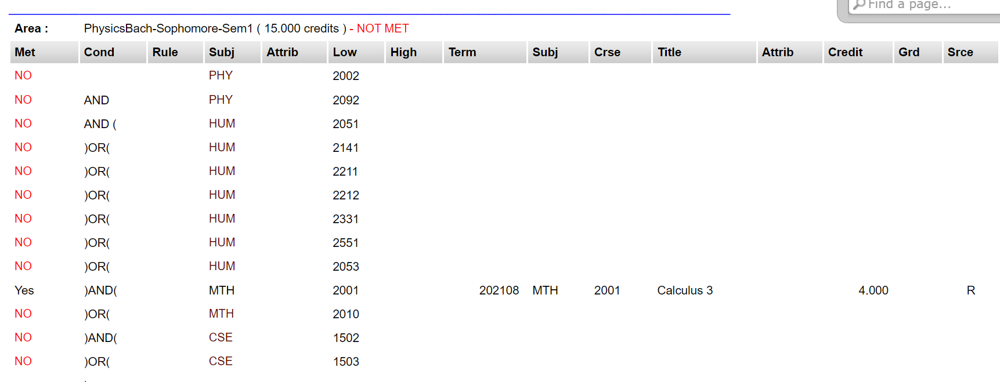

*Continued from [Part I](../Coursegraph/index.html)*

*Note: This two-part post was originally written as a single Jupyter Notebook [(download here)](../Coursegraph/coursegraph.ipynb).*

# Parsing the CAPP Report
Now that we've constructed our course graph, we have the data necessary to make sense of the CAPP report.

## Scraping the Data
PAWS (Florida Tech's Panther Access Web System) can display CAPP reports in three formats: Detailed, General, or Additional Information. I'll select the "detailed" version:

</img>

And I'll manually download the .html page by pressing <code>ctrl+s</code> in my browser.

</img>

The data on these pages is stored in tables, so we should probably keep it in that format. Let's try using pandas.read_html() to get the information:

<pre><code class="language-python"># read_html gives us a list of dataframes. The indices are as follows:
# [0]  - nothing useful
# [1]  - overall credit requirements
# [2]  - program information
# [3:-3] - actual course reqs.
# [-3] - in-progress courses (MAY NOT APPEAR)
# [-2] - courses not used    (MAY NOT APPEAR)
# [-1] - letter key (H - History, etc.)
CAPP_data = pd.read_html('webpages/CAPPpages/detailed 2.html')
print(CAPP_data[3].iloc[2, :]) # try printing a row</code></pre>

<pre><code class="language-plaintext">OUTPUT:
0                          Yes
1                          NaN
2                          NaN
3                          COM
4                          NaN
5                         1101
6                          NaN
7                       202008
8                          COM
9                         1101
10    Composition and Rhetoric
11                         NaN
12                       3.000
13                           T
14                           T
15                         NaN
Name: 2, dtype: object</code></pre>

Wow, that worked!

This doesn't usually happen!

Let's start crunching it.

<pre><code class="language-python">credit_info = CAPP_data[1]
program_info = CAPP_data[2]
course_info = CAPP_data[3:]
# Saves all data to .csv for debugging
# Excel or google sheets is great for looking at all the info
pd.concat([credit_info, program_info, *course_info]).to_csv('webtest.csv', encoding='utf-8',sep='\t')</code></pre>
<pre><code class="language-python"># checks if any strings in a dataframe contain a value
# mild TODO: vectorize this somehow
def is_in_df(df, my_str):
    for ri, row in df.iterrows():
        for ci, val in row.items():
            if my_str in str(val):
                return True
    return False

req_data = []
other_data = []
for table in course_info:
    # strip out all whitespace
    table = table.apply(lambda x: x.str.strip() if x.dtype == "object" else x)
    # look a couple code blocks below for a list of all the metadata that dataframes are tagged with
    
    if is_in_df(table, 'R - Currently Registered'):
        # this is the 'Source Code Key' table
        table.attrs['type'] = 'SCC'
        other_data.append(table)
    elif table.shape[1] == 7:
        # this is the 'In-Progress Courses' table
        table.attrs['type'] = 'IPC'
        other_data.append(table)
    elif table.shape[1] == 6:
        # this is the 'Courses Not Used' table
        table.attrs['type'] = 'CNU'
        other_data.append(table)
    elif table.shape[1] == 16:
        # this is one of the actual course tables
        # print('REQUIREMENTS FOUND: ' + str(table.shape[0]-3) + ' condition(s)')
        table.attrs['type'] = 'REQ'
        
        table_title = table.iloc[0, 3]
        
        # save table metadata in dataframe attributes
        req_infos = '-'.join(table_title.split('-')[:-1])
        table.attrs['req id'] = req_infos.split('(')[0].strip()
        table.attrs['credits'] = float(req_infos.split('(')[-1].split('credits')[0])
        table.attrs['met'] = not ('NOT' in table_title.split('-')[-1].upper())
        table.attrs['is semester'] = 'Sem1' in table_title or 'Sem2' in table_title
        if table.attrs['is semester']:
            i = -1
            sm = table.attrs['req id'].lower()
            if 'freshmen' in sm:
                i = 0
            elif 'sophomore' in sm:
                i = 2
            elif 'junior' in sm:
                i = 4
            elif 'senior' in sm:
                i = 6
            else:
                table.attrs['is semester'] = False
            
            if '2' in sm:
                i = i+1
            table.attrs['semester id'] = i
        
        req_data.append(table.iloc[2:-1 , :]) # These rows have nothing useful</code></pre>

We've successfully extracted the metadata from our tables, and removed all junk data. Now we need to actually parse our data. Thankfully, we already have a PDAG parser that takes input in the <code>['(', 'MTH2001', 'OR', 'MTH2011', ')']</code> form! We just need to adapt the present information to fit this standard.

Also, we have the handy <code>fix_formatting()</code> function from earlier, so we won't have to worry about parenthesis.

<pre><code class="language-python">for i in range(0, len(req_data)):
    df = req_data[i]
    # I'm going to iterate through the dataframes.
    # This is an anti-pattern in Pandas, and generally frowned upon, but I think
    # vectorization would introduce unnecessary complexity into the code.
    
    # Once again, the formatting in the data is inconsistent.
        # There are a few weird cases on my report:
        #
        # 1: Every column says PHY3152/53 or something like that
        #    Sometimes it's "A and B", other times it's "A & B", or "A/B".
        #    By 'every', I mean in rule/subj/attrib/low/high.
        #    This appears to happen for all courses with labs.
        #    I'm pretty confident that this wasn't an intentional feature.
        #
        # 2: low/high are actually used (e.g. low:2000, high:4999)
        #    Each instance of this case is paired with one of the following cases:
        #
        # 3: Low/high are set to 2XXX and 4XXX, respectively
        #    I guess either case 2 or 3 wasn't working, so they put in the other but didn't remove the old one?
        #    Anyway, they mean the same thing. Probably safe to include both instances in the network, then
        #    remove the duplicate edge? I want to mess with the formatting as little as possible
        #
        # 4: The row does not specify a course range / CRN.
        #    This happens with elective requirements and other gen-ed stuff.
        #
        # 5: The row only contains a right parenthesis.
        #
        # THERE IS A HIGH CHANCE THAT ADDITIONAL CAPP REPORTS WILL HAVE CASES I HAVEN'T DOCUMENTED HERE
    
    statement = []
    for i in range(0, df.shape[0]):
        
        met =  df.iloc[i, 0]
        cond = df.iloc[i, 1]
        
        rule = df.iloc[i, 2]
        subj = str(df.iloc[i, 3])
        low  = str(df.iloc[i, 5])
        high = str(df.iloc[i, 6])
        
        course_id_2 = str(df.iloc[i, 8]) + str(df.iloc[i, 9])
        
        # if the locical operator column is non-empty at this row, add it to the string
        if str(cond).lower()!='nan':
            if ')' in cond:
                statement.append(')')
            if 'and' in cond.lower():
                statement.append('and')
            elif 'or' in cond.lower():
                statement.append('or')
            if '(' in cond:
                statement.append('(')
        
        # ------------------------ CASE HANDLING ------------------------ #
        # (see lengthy comment above this loop for details)
        
        # CASE 5 (rparen)
        if str(met).lower()=='nan':
            pass
            
            # CASE 1 (and)
        elif ('and' in low.lower()) or ('/' in low.lower()) or ('&' in low.lower()):
            # IMPORTANT: This assumes that this case only ever has one departament (no 'MTH1000 and PSY1000')
            # However, it can handle an arbitrary number of 'and's
            CRNs = list(set(re.findall('[0-9][0-9][0-9][0-9]', low + ' - ' + high + ' - ' + subj)))
            dept = list(set(re.findall('[A-Z][A-Z][A-Z]', low + ' - ' + high + ' - ' + subj)))[0]
            
            to_add = ['('] # put everything in a paren block since OOO prioritizes OR over AND
            for i in range(0, len(CRNs)):
                to_add.append(dept + CRNs[i])
                
                # here we fill the courselist's entries with new data we gathered from the CAPP report
                ck = next((c for c in CL if c.course_id == dept + CRNs[i]), None)
                if ck is not None:
                    # check if the course was taken / condition met
                    va = CL.index(ck)
                    CL[va].met |= ('yes' in met.lower())
                    CL[va].in_major = True
                    # copy the requirement metadata over to every node
                    CL[va].req_attrs.append(df.attrs)
                
                if i != len(CRNs) - 1:
                    to_add.append('or')
            to_add.append(')')
            statement.extend(to_add)
            
            # CASE 2 (XXXX)
        elif ('x' in low.lower()) or ('x' in high.lower()):
            # find course range by finding maximum and minimum possible course vals by substituting 'x' for 9 and 0
            mina = min(int(low.lower().replace('x', '0')), int(high.lower().replace('x', '0')))
            maxa = max(int(low.lower().replace('x', '9')), int(high.lower().replace('x', '9')))
            
            # iterate through courselist and find any courses in the range [mina, maxa], then add them
            good_courses = []
            for x in CL:
                if x.course_code == subj and x.course_num &gt;= mina and x.course_num &lt;= maxa:
                    good_courses.append(x.course_id)
                    
                    # entry filling like in case 1
                    va = CL.index(x)
                    CL[va].met |= ('yes' in met.lower() and x.course_id == course_id_2)
                    CL[va].in_major = True
                    CL[va].req_attrs.append(df.attrs)
            
            for i in range(0, len(good_courses)):
                statement.append(good_courses[i])
                if i != len(good_courses) - 1:
                    statement.append('or')
            
            # CASE 3 (low/high)
        elif low.isnumeric() and high.isnumeric():
            good_courses = []
            # iterate through courselist and find any courses in the range [low, high], then add them
            for x in CL:
                if x.course_code == subj and x.course_num &gt;= int(low) and x.course_num &lt;= int(high):
                    good_courses.append(x.course_id)
                    
                    # entry filling like in case 1
                    va = CL.index(x)
                    CL[va].met |= ('yes' in met.lower() and x.course_id == course_id_2)
                    CL[va].in_major = True
                    CL[va].req_attrs.append(df.attrs)
            
            # put it all in an 'or' block
            for i in range(0, len(good_courses)):
                statement.append(good_courses[i])
                if i != len(good_courses) - 1:
                    statement.append('or')
        
            # CASE 4 (no course range / num specified)
        elif str(rule).lower()!='nan' and not low.isnumeric() and not high.isnumeric():
            pass
        
            # DEFAULT CASE (CRN in low)
        else:
            # just copy the id over
            statement.append(subj + low)
            
            # entry filling like in case 1
            ck = next((c for c in CL if c.course_id == subj + low), None)
            if ck is not None:
                va = CL.index(ck)
                CL[va].met |= ('yes' in met.lower())
                CL[va].in_major = True
                CL[va].req_attrs.append(df.attrs)
            
    statement = fix_formatting(statement)
    df.attrs['statement'] = statement</code></pre>
<pre><code class="language-python"># ALL DATAFRAME ATTRIBUTES:

# ATTRIBUTE KEY - EXAMPLE - DESCRIPTION

# 'type'        - 'SCC'/'IPC'/'CNU'/'REQ'       - source code key / in progress courses / courses not used / requirements
# 'req id'      - 'PhysicsBach-MTH-or-CSE'      - identifier for the requirement
# 'credits'     - 6.0                           - credits needed to fulfill this requirement
# 'met'         - True                          - has this requirement been met?
# 'is semester' - True                          - does this requirement correspond with a semester?
# 'semester id' - 5                             - value from 0-7 indicating which semester this requirement is for
# 'statement'   - ['MTH1001', 'and', 'MTH1000'] - the logic used to determine if the requirement has been fulfilled
        
#ept_list = unique_depts([x for x in CL if x.in_major])
#dept_color_map = dict(zip(dept_list, distinctipy.get_colors(len(dept_list), pastel_factor=0.9, colorblind_type='Tritanopia')))

SG_reqs = nx.DiGraph()
for x in req_data:
    q = get_PDAG(x.attrs['statement'], x.attrs['req id'], 'requirement')
    SG_reqs = nx.compose(SG_reqs, q)

for x in CL:
    if x.in_major:
        DG2 = get_PDAG(x.prerequisites, x.course_id, 'prerequisite')
        SG_reqs = nx.compose(SG_reqs, DG2)
        
for x in CL:
    if x.in_major:
        DG2 = get_PDAG(x.corequisites, x.course_id, 'corequisite')
        SG_reqs = nx.compose(SG_reqs, DG2)

for x in CL:
    if x.in_major:
        DG2 = get_PDAG(x.recommended, x.course_id, 'recommended')
        SG_reqs = nx.compose(SG_reqs, DG2)

for x in CL:
    if x.in_major:
        DG2 = get_PDAG(x.complements_courses, x.course_id, 'complements')
        SG_reqs = nx.compose(SG_reqs, DG2)
        
disp_PDAG(SG_reqs)</code></pre>

## Graduation Requirement Network
*Note: You can view an interactive version of the following network [here.](grph_pdag/index.html) Be sure to enable physics.*

That was easier than I expected. My physics major CAPP report has been turned into a network:

</img>

However, this network isn't very helpful. It is currently:

* **Hard to read.** The nodes are too small/spread out, and they lack useful information about the courses.
* **Hard to comprehend.** It might be difficult to understand how the OR/AND triangle nodes work.
* **Unorganized.** The courses should be arranged by semester in chronological order.
* **Overwhelming.** So much data is being displayed that it is difficult to grasp any meaningful insights from it.

Pyvis, our current visualization tool, is great for viewing the large-scale structure of a network, but it doesn't support any hierarchical layouts. We'll need a better tool to display these networks.

# Visualization
While working on this project, I've experimented with **Pyvis**, **Networkx**, **Graphviz**, and **Holoviz**/**Holoviews**. Out of the four, **Pyvis** and **Graphviz** created the most effective visualizations with the least hassle.

Still, they're not easy to use. Pyvis is essentially a bridge from Python to the larger **vis.js**, a comprehensive browser-based visualization library. The documentation for vis.js is great, but for Pyvis... not so much. Similarly, Graphviz is a CLI tool that I can use here because of a Python interfaces that connect me to the tool. The docs for this interface are also unsatisfactory.

Because of the shoddy documentation and my lower comfort level in Python, I'm going to export the data and write the visualizer in another language.

## Exporting
I could export to JSON through NetworkX, but I feel like cleaning things up a little first.

<pre><code class="language-python">node_export = {}
for n in SG_reqs.nodes(data=True):  
    node_properties = {
        'is logic'     : len(n[0].strip()) &gt; 7,
        'is semester'  : False,
        'is operator'  : False,
        'operator'     : 'No operator!',
        'in major'     : False,
        'credits'      : 0,
        'name'         : 'No course name provided!',
        'code'         : 'No code provided!',
        'num'          : -1,
        'description'  : 'No description provided!',
        'met'          : False,
        'tags'         : [],
        'req ids'      : [], # ids of parent requirement groups
        'semesters'    : [], # indices of parent requirement semesters
        'color'        : '#FFFFFF'
    }
    
    if not node_properties['is logic']:
        crs = next((c for c in CL if c.course_id == n[0]), None)
        if crs is not None:
            node_properties['in major'] = crs.in_major
            node_properties['credits'] = crs.credit_hours
            node_properties['name'] = crs.course_name
            node_properties['code'] = crs.course_code
            node_properties['num'] = crs.course_num
            node_properties['description'] = crs.description
            node_properties['met'] = crs.met
            node_properties['tags'] = crs.tags
            
            # nodes could belong to multiple semesters
            for x in crs.req_attrs:
                if 'semester id' in x:
                    node_properties['semesters'].append(x['semester id'])
                node_properties['req ids'].append(x['req id'])
        node_properties['semesters'] = list(set(node_properties['semesters']))
    else:
        # So, yes, I'm pulling these values from the triangle visualization code from earlier.
        # Probably not the best idea. TODO: Store operator type data elsewhere.
        if n[1]['shape'] == 'box' and ('freshmen' in n[0].lower() or 'junior' in n[0].lower() or
                                       'sophomore' in n[0].lower() or 'senior' in n[0].lower()):
            node_properties['is semester'] = True
        if n[1]['shape'] == 'triangle':
            node_properties['operator'] = 'AND'
            node_properties['is operator'] = True
        if n[1]['shape'] == 'triangleDown':
            node_properties['operator'] = 'OR'
            node_properties['is operator'] = True
    
    if node_properties['code'] in dept_color_map:
        node_properties['color'] = col_to_hex(dept_color_map[node_properties['code']])
    
    node_export[n[0]] = node_properties

edge_export = []
for e in SG_reqs.edges(data=True):
    node_a = e[0]
    node_b = e[1]
    node_type = e[2]['title']
    # very inefficient! very readable... :3
    edg = {'start' : node_a, 'end' : node_b, 'type' : node_type}
    edge_export.append(edg)

# req data is already well-formatted
reqs_export = []
for x in req_data:
    reqs_export.append(x.attrs)

# JSON is very easy in Python
to_export = {'nodes' : node_export, 'edges' : edge_export, 'requirements' : reqs_export}
with open('visualizer/mynetwork.json', 'w') as outfile:
    json.dump(to_export, outfile)

print('Exported!')</code></pre>

# Done!
The tough work, anyway.

The rest of this adventure happens in Javascript. JS is more prototype-OO-ish stuff, so documenting my process like I've done here doesn't really work. Also, the code is a mess since I wrote it in a rush.

Regardless of its quality, the JS program is a browser-based specialized hierarchical-but-also-force-based graph drawing tool. Most of the code is drawing-focused, but a significant portion of it is dedicated to translating the JSON from an edge list into a linked list. It has some quirks, but I love the way it looks, and it's actually helped me think about what courses I need to take!

You can view the end result [here](visualizer/index.html). Thanks for reading!