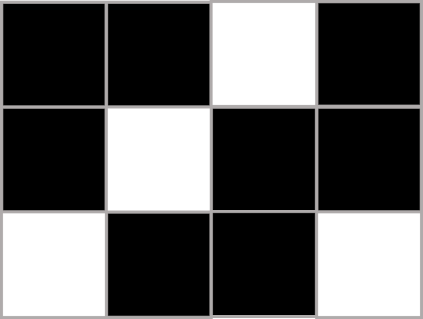

## The Dither

When quantizing the values of a signal/image intended for human perception, it is often worthwhile to sacrifice some high-frequency detail in exchange for improved low-frequency structure. This is typically done via **dither**: noise, typically [blue noise](https://blog.demofox.org/2018/01/30/what-the-heck-is-blue-noise/), that is intentionally introduced into the signal/image in order to mitigate the low-frequency effects of quantization. We can state a few requirements for "good" dither:
1. It should be isotropic (this doesn't apply to 1D signals)
2. It should not have low-frequency components
3. The dithered and quantized signal/image should preserve the values of the original when a low-pass filter is applied to it

Some examples of bad dithering. 1 has anisotropy, 2 has too much low-frequency noise, and 3 is significantly brighter than the original photo.

Good dither is hard to come by, and there is an active (small) field of research in developing new algorithms to create it. Among images (the topic of this article), there are a few dominant strategies employed in most software applications:
1. **Ordered dithering**: A simple method which can be trivially parallelized. Looks very artificial/digital, and typically only employed to give things a "retro" look.
2. **Thresholding**: An even simpler method, usually employing a premade blue noise texture (computing this texture can be challenging). Very common in realtime graphics applications.
3. **Error diffusion**: A straightforward (but harder to parallelize) strategy with better detail preservation and a stronger conceptual foundation.
4. **Nothing**: Unfortunately, a very common dithering "solution". Results in undesirable banding artifacts and severe loss of both structure and detail.
5. **Fancier methods**: There are many.

This article will focus on error diffusion; there are plenty of good resources out there regarding [the](https://surma.dev/things/ditherpunk/) [other](http://momentsingraphics.de/BlueNoise.html) [three](https://ieeexplore.ieee.org/document/4908961) interesting options.

Error diffusion is exactly what it sounds like: the pixels in the image are quantized sequentially, ordered via some spacefilling pattern (almost always scanlines, but [other strategies work](https://www.compuphase.com/riemer.htm)). When a pixel is quantized, it has some amount of error (deviation from its original value). This quantization error is then diffused (just added) to the surrounding pixels via a **diffusion kernel**. I'll explicitly illustrate this process for the following kernel:

$$ \textbf{K}=\begin{bmatrix} * & \frac{1}{2} \\\\ \frac{1}{2} & 0 \end{bmatrix} $$

Where the asterisk represents the target pixel. I'll attempt to quantize a purely monotone 4x3 "image" of constant brightness 0.3 (1.0 = white):

Our quantization process rounds to the nearest integer (our output image has 1 bit / pixel).

Beginning in the upper left, we quantize the first pixel with an error of +0.3. Using our kernel, $ K $, we see that we must propagate this error both down and to the right, multiplying it by 0.5. In other words, we simply *change the brightness of the neighboring pixels* based on the amount of error.

We quantize the next pixel, except now our error has increased; some of it has carried over from the first quantization.

Now when we go to quantize the next pixel, the error has built up enough that the pixel is set to 1.0! Despite the fact that this pixel was originally 0.3 like all the others, the error "built up" enough that a white pixel appeared. Though now our error is in the opposite direction, and the neighboring pixels feel the effect. Eventually, our image is 33% white pixels — about what we would expect from a brightness of 0.3!

In this example, scanlines go left-to-right, but we lose some error to "the void". A ping-pong approach remedies this.

With a few caveats, error diffusion provides a statistical gaurentee that it will at least capture the appropriate brightness of flat tones. We'll cover these (rather important) exceptions later, but for now, I'd like to focus on (an)isotropy. Let's tell a computer to perform the same process we just did above on a larger scale:

For now, nevermind that it somehow looks brighter than the gray from earlier — what's up with those diagonal lines? We're quantizing a flat gray; we don't want to introduce some arbitrary direction into our image.

It's pretty clear *why* this happens: if we keep pushing the error in the same directions every time, we're probably going to end up with some pseudo-uniform repeating process. However, it's harder to characterize exactly *how* this happens. We know of a few kernels that do a decent job of avoiding it:

**Floyd-Steinberg**

$$ \frac{1}{16} \begin{bmatrix} - & * & 7 \\\\ 3 & 5 & 1 \end{bmatrix} $$

**Atkinson**

$$ \frac{1}{8}\begin{bmatrix} - & * & 1 & 1 \\\\ 1 & 1 & 1 & 0 \\\\ 0 & 1 & 0 & 0 \end{bmatrix} $$

**Stucki**

$$ \frac{1}{42}\begin{bmatrix} - & - & * & 8 & 4 \\\\ 2 & 4 & 8 & 4 & 2 \\\\ 1 & 2 & 4 & 2 & 1 \end{bmatrix} $$

But I digress; we're not here to waddle around in the history of arbitrary matrices. Instead, we're going to build them from scratch.

## Changing Domains

An image and its 2D Fourier transform. Pixels representing lower frequencies are closer to the center of the periodogram. The lines across the frequency domain correspond to the sharp edges present in the source image. Only log-scaled amplitudes are shown; phase information is discarded. This will remain true for all following periodograms.

To computationally explore the space of kernel matrices, we'll need to assign some sort of cost function to a matrix. How do we judge the quality of a dithered photo? In some respects, this is a matter of taste, so we'll make our test very dry and boring:
1. Dither/quantize a constant-color image using the kernel (like we did above)
2. Transform the image into its frequency-space representation using a 2D Fourier transform
3. Check how well this 2D periodogram matches our ideal noise spectrum

But what is our ideal noise spectrum? Recall our first two conditions for "good" dither: isotropy and no low-frequency components. Amazingly, this is sufficient to describe what our Fourier transform should look like:

No low frequencies (dark in the middle), noisy elsewhere, and isotropic (radially symmetric). Actually, this is also the ideal spectrum for both blue noise and poisson disk sampling. Our results won't look this nice (quantization constrains us), but this is what we're aiming for.

* *Note: You might wonder why we can't generate blue noise / dither / disk samples by applying an inverse Fourier transform to the "ideal" spectrum above. The reason relates to phase information; see [this article](https://blog.demofox.org/2021/12/29/why-cant-you-design-noise-in-frequency-space/) by Alan Wolfe for further discussion.*

Before we get into quantifying the "disky-ness" of a periodogram, I want to point out that the black disk in the middle is not a fixed size: it changes depending on the brightness of the unquantized image. An image with a brightness of 0.001 will have sparsely spaced hotspots in its error-diffused quantized version, leading to a smaller (lower frequency) black disk. Meanwhile, an image with a brightness of 0.1 will have many more spots (higher frequency), and thus a bigger disk. We can even approximate the disk size:

We model our dithered image as a set of points occupying a region with density $ \sigma $ points / px. Assuming our region is equally divided into approximately circular areas by each point (each with radius $ \rho $), we have:

$$ \rho=\sqrt{\frac{1}{\sigma\pi}} $$

But our disk size is proportional to frequency, and frequency $ f\propto \frac{1}{\rho} $, so:

$$ R_\textrm{disk}\propto f\propto\sqrt{\sigma} $$

**However**, this approximation only works for small $ \sigma $. As neighboring pixels begin to touch (maybe $ \sigma\approx 0.2 $), the image begins to saturate, and at $ \sigma=0.5 $, the *dark* pixels become the anomaly, and $ f\propto \sqrt{1-\sigma} $. So the circle size is a bump-like function $ R_\textrm{disk}(\sigma) $ with $ R_\textrm{disk}(0)=R_\textrm{disk}(1)=0 $ with some nontrivial analytical expression. So we won't be considering disk radius in our error diffusion cost function.

## The Cost

Determining the quality of our dither (i.e. measuring the aforementioned "disky-ness" of our periodograms) is surprisingly difficult. I'll outline a simple method here:

1. Generate the periodogram via a 2D FFT.
1. Transform the periodogram to polar coordinates to give lower frequencies increased weight in the next step.
2. Build a distribution by summing over each angle bin.
3. Calculate the absolute numerical derivatives of this distribution.
5. Sum these derivatives and return the number. A lower score indicates "better" dither.

Plots of steps 1-4 in the provided algorithm (with source dither shown above).

This is not a very good technique (it is very noisy); but it is at least somewhat intuitive. Ultimately, the goal of any scoring algorithm is to discover some cost function $ C(\textbf{K}, \sigma) $ for a diffusion kernel $ \textbf{K} $ and a point density $ \sigma $ that maximizes the isotropy of the dither generated by the kernel.

Searches over the parameter space of $ C(\textbf{K}, \sigma) $ function are nothing new; the most famous example was done in 2001 by [Victor Ostromoukhov](https://perso.liris.cnrs.fr/victor.ostromoukhov/) of the Université de Montréal in his >250 citation paper ["A Simple and Efficient Error-Diffusion Algorithm"](https://dl.acm.org/doi/abs/10.1145/383259.383326) ([ResearchGate link](https://www.researchgate.net/publication/2496750_A_Simple_and_Efficient_Error-Diffusion_Algorithm)). Ostromoukhov studied matrices of the form:

$$ \frac{1}{a+b+c} \begin{bmatrix} - & * & a \\\\ b & c & 0 \end{bmatrix} $$

Unfortunately, I haven't been able to find a good *visualization* of this space, which I think would probably look quite interesting if rendered in sufficient detail. I'm working on generating one for matrices of the form (worse results than Ostromoukhov's form, but I'm starting simple):

$$ \frac{1}{\alpha + \beta + \gamma} \begin{bmatrix} * & \alpha \\\\ \beta & \gamma \end{bmatrix} $$

A note about visualization: because of our normalization factor,

$$ \frac{1}{\alpha + \beta + \gamma} \begin{bmatrix} * & \alpha \\\\ \beta & \gamma \end{bmatrix} =
\frac{1}{1 + \alpha/\gamma + \beta/\gamma} \begin{bmatrix} * & \alpha/\gamma \\\\ \beta/\gamma & 1 \end{bmatrix} $$

So really, we only have a two-dimensional space: $ \alpha/\gamma $ and $ \beta/\gamma $. Imposing the (admittedly arbitrary) requirement that all kernel elements are positive, we find that our parameter space occupies a triangular region of the plane $ \alpha + \beta + \gamma =1 $ in the first octant.

Here's a very noisy preview ($ \sigma = 0.4 $):

I'm currently writing a more sophisticated cost function and optimizing my code. Once I have it, I'll post the visualization to this website.

## Caveat: Gamma

This is a warning to anyone who naively attempts to implement error diffusion (or any dithering algorithm): [**learn about gamma correction**](https://en.wikipedia.org/wiki/Gamma_correction#Computer_displays). It is more important than you might know; let me demonstrate:

If you see moiré patterns, try zooming in/out or downloading the image and displaying it at exactly 100% scale (1 texel / pixel).

The left side of this image has a checkerboard pattern where 50% of the pixels are white (#ffffff) and the others are black (#000000). The right side is exactly fifty percent gray (#7f7f7f). Our kernel normalization condition is based on the assumption that these brightnesses are equal, yet they are clearly not. This is because of the disappointing fact that **computer monitors do not display colors linearly**: a brightness of 100 is *not* the sum of two pixels with a brightness of 50.

Gamma correction involves transforming pre-transforming all images *into* a space where their brightnesses add linearly, then un-transforming them afterwards. I won't go over the details here, but know that it is one of the most important and oft-neglected aspects of computer displays.

## Fin

That's all for now! This is a fun topic and I do have more to say, so I'll probably revisit it in the future. Maybe something with the nuances of color, or getting more mathematical with kernel matrices (chaotic systems!).

'Till next time!