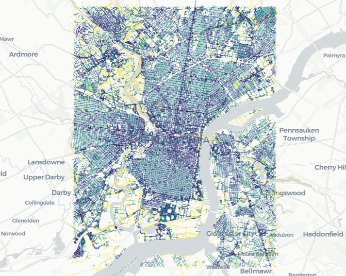
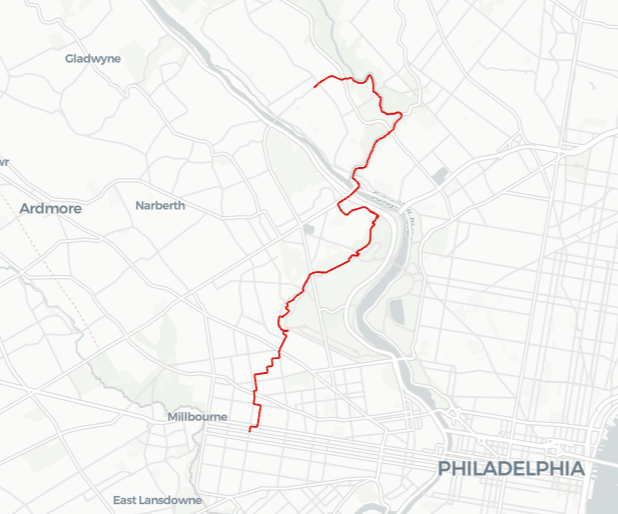

*This post was originally written as a Jupyter notebook. Download it [here](transportation_splitter_notebook.ipynb).*

[Overture Maps](https://overturemaps.org/) releases [transportation data](https://docs.overturemaps.org/guides/transportation/) with a unique, comprehensive schema. Let's build a routing network with it!

Overture's data consists of *segments*: LineStrings representing paths (roads, walkways, train tracks, etc.). These segments contain many linearly-referenced features, including *connectors*: places where you can hop from one path to another (intersections, off-ramps, etc.). There's no practical limit on the number of connectors a segment can have; a highway can have many off-ramps.

Unfotunately, this schema isn't exactly conducive to routing. Routing frameworks expect *directed graphs*, where each edge is gaurenteed to be connected to only two nodes. In its native form, Overture's data is *almost* a [hypergraph](https://en.wikipedia.org/wiki/Hypergraph), where 'connectors' are nodes and 'segments' are (hyper-)edges — but edges in hypergraphs are typically unordered sets, so this isn't quite right, either.

In any case, unless we want to write a novel routing engine from scratch (which might take a while; contraction hierarchies are messy), we'll need to somehow transform Overture's data into a directed graph. That means splitting apart each segment at each of its connectors. Thankfully, [Brad Richardson](https://github.com/brad-richardson) (Meta) and [Cozmin Bantea](https://github.com/ibnt1) (Microsoft) already did the hard part for us by writing the open-source tool [transportation-splitter](https://github.com/OvertureMaps/transportation-splitter)! Let's get that running.

*Note: This has been [done before, by Paul Ramsey](https://www.crunchydata.com/blog/vehicle-routing-with-postgis-and-overture-data), but not in a way that I can easily run on my PC! I'll be reworking this example with a local, open-source stack.*

## Running transportation-splitter Locally

`transportation_splitter.py` uses Apache Spark — a powerful, distributed analytics engine — to do its heavy lifting. Setting up spark locally is a little awkward, but it'll probably take less time than rewriting all the UDFs and operations to use something like DuckDB ([Ibis](https://ibis-project.org/) might simplify this).

To get the script working, I had to (updated Dec. 18, 2024):
1. Install [Apache Spark 3.5.2](https://archive.apache.org/dist/spark/spark-3.5.2/) (not 3.5.3, version numbers are very important here)
2. Run `pip install pyspark==3.5.2 apache-sedona pyproj shapely`
3. Download the Windows [Hadoop Binaries, v3.5.3](https://github.com/cdarlint/winutils) (my Linux box is dead)
5. Set the following environment variables:

<pre><code class="language-bash">PYSPARK_PYTHON=python
# spark install directory
SPARK_HOME=path/to/spark-3.5.2-bin-hadoop3
# folder containing 'bin' folder with Hadoop binaries
HADOOP_HOME=path/to/hadoop-3.3.6
# add everything to the path
PATH=%PATH%;%HADOOP_HOME%\bin;%SPARK_HOME%\bin
</code></pre>

*Note: You may also need to manually resolve some dependencies by adding something to the path / copying a .jar file somewhere; check your error messages carefully.*

Next, `transportation_splitter.py` expects a couple variables to exist when it's run: `spark` and `sc`. We can initialize them locally, using Maven to fetch dependencies:

<pre><code class="language-python">from sedona.utils import SedonaKryoRegistrator, KryoSerializer
from sedona.spark import SedonaContext

def get_local_context():
    config = SedonaContext.builder().master("local[*]").appName("test app").config('spark.jars.packages', \
    'org.apache.sedona:sedona-spark-shaded-3.5_2.12:1.7.0,' \
    'org.datasyslab:geotools-wrapper:1.7.0-28.5,' \
    'org.apache.hadoop:hadoop-common:3.3.4,' \
    'com.google.code.gson:gson:2.9.0,' \
    'org.apache.hadoop:hadoop-aws:3.3.4,' \
    'org.apache.parquet:parquet-hadoop:1.15.0,' \
    'com.amazonaws:aws-java-sdk-bundle:1.12.262') \
    .config("spark.hadoop.fs.s3a.impl", "org.apache.hadoop.fs.s3a.S3AFileSystem") \
    .config("spark.hadoop.fs.s3a.endpoint", "s3.us-west-2.amazonaws.com") \
    .config("spark.hadoop.fs.s3a.connection.maximum", "100") \
    .config("spark.hadoop.fs.s3a.aws.credentials.provider", "org.apache.hadoop.fs.s3a.AnonymousAWSCredentialsProvider") \
    .config("spark.serializer", KryoSerializer.getName) \
    .config("spark.kryo.registrator", SedonaKryoRegistrator.getName) \
    .getOrCreate()

    return SedonaContext.create(config)
</code></pre>
We can use the key-less `AnonymousAWSCredentialsProvider` because Overture keeps its parquets in a publicly accessible s3 bucket!

Next, let's import `transportation_splitter.py` (`spark` isn't defined as a global, so nothing should run), and write/run a shallow wrapper method:

<pre><code class="language-python">import transportation_splitter
import pyspark

def retrieve_and_split(spark: SedonaContext,
                       sc: pyspark.SparkContext,
                       base_output_path: str,
                       overture_release_version: str="2024-11-13.0",
                       overture_release_path: str="s3a://overturemaps-us-west-2/release",
                       wkt_filter: str="POLYGON ((-75.247 40.038, -75.247 39.870, -75.077 39.870, -75.077 40.038, -75.247 40.038))") -> pyspark.sql.DataFrame:

    # Some of this copied from the end of transportation_splitter.py
    input_path = f"{overture_release_path}/{overture_release_version}/theme=transportation"
    filter_target = "global" if not wkt_filter else "filtered"
    output_path_prefix = f"{base_output_path}/{overture_release_version}/{filter_target}"

    wrangler = transportation_splitter.SplitterDataWrangler(input_path=input_path, output_path_prefix=output_path_prefix)
    result_df = transportation_splitter.split_transportation(spark, sc, wrangler, wkt_filter)

    return result_df

spark = get_local_context()
# Useful for fixing broken installs! (if you can access stdout)
spark.sparkContext.setLogLevel("DEBUG") 

import os
# This might take some time...
philly_df = retrieve_and_split(spark, spark.sparkContext, f"file:///{os.getenv("GIS_DIR")}/split_output/")
</code></pre>

Alright, that took me over an hour (PySpark is slow to write GeoParquet files on my machine, apparently)! Everything's saved to the disk, but for convenience, I'll serialize the output in case something happens to my session:

<pre><code class="language-python">import pickle

# If re-opening the notebook later after running everything, start from this cell
if 'philly_df' in locals():
    with open('philly_split_df.pickle', 'wb') as handle:
        df = philly_df.toPandas()
        pickle.dump(df, handle, protocol=pickle.HIGHEST_PROTOCOL)
else:
    with open('philly_split_df.pickle', 'rb') as handle:
        df = pickle.load(handle)
</code></pre>

## Exploring the Split Data

Let's peek inside the output. I'm going to switch to an in-memory representation of our data (Pandas) for performance reasons (I do not have a cluster at my disposal).

<pre><code class="language-python">import geopandas as gpd
import pandas as pd
import numpy as np
gdf = gpd.GeoDataFrame(df, crs="EPSG:4326") # Coordinates are in degrees
print(gdf.info())
</code></pre>

We've got ~250k edges with plenty of attributes. Let's make sure that each of these edges connects to just two nodes:

<pre><code class="language-python"># Time to see if our split worked!
print("connectors | count")
conn, count = np.unique([len(e) for e in gdf[gdf['type']=='segment'].connectors], return_counts=True)
for cn, co in zip(conn, count):
    print(f"{cn:10} | {co}")
</code></pre>
<pre><code>Output:
connectors | count
         2 | 164393
         3 | 233
         4 | 66
         5 | 23
         6 | 21
         7 | 7
         8 | 9
         9 | 7
        10 | 4
        11 | 5
        12 | 1
        13 | 1
        15 | 1
        32 | 1
        33 | 1
        46 | 1
</code></pre>

Hm... *most* of them do, but there are a few hundred stragglers in there. Let's look at those and see if we can figure out what's going on:

<pre><code class="language-python">gdf = gpd.GeoDataFrame(df, crs="EPSG:4326")
gdf_segments = gdf[gdf['type']=='segment']
gdf_connectors = gdf[gdf['type']=='connector']

non_binary_segments = gdf_segments[gdf_segments.connectors.map(len) > 2]

# lonboard wrapper to make for easy visualization of GeoDataFrames
import lonboard
from lonboard.basemap import CartoBasemap
from lonboard.colormap import apply_continuous_cmap
from matplotlib import colormaps, colors
def display_with_lonboard(geo_data: gpd.GeoDataFrame,
                          node_colors: np.ndarray[np.floating] | None=None,
                          edge_colors: np.ndarray[np.floating] | None=None,
                          mpl_colormap: str = 'viridis') -> lonboard.Map:
    
    # Generate geometry color lists, if needed
    def gen_color_list(data):
        normalized_attribs = colors.Normalize(np.min(data), np.max(data))(data)
        cols = apply_continuous_cmap(normalized_attribs, colormaps[mpl_colormap])
        return cols
    edge_color_list = [219, 12, 4] # red
    if edge_colors is not None:
        edge_color_list = gen_color_list(edge_colors)
    node_color_list = [100, 44, 191] # purple
    if node_colors is not None:
        node_color_list = gen_color_list(node_colors)
    
    # Convert columns with non-primitive dtypes to strings
    # ... we need to do this, or lonboard throws an error
    geo_data_parseable = gpd.GeoDataFrame()
    for col, type_ in zip(geo_data.keys(), geo_data.dtypes):
        if type_ == object:
            geo_data_parseable[col] = geo_data[col].apply(lambda x : str(x))
        else:
            if col == 'geometry':
                # Geopandas asked me to do this -- automatic geometry id'ing will be deprecated in the future
                geo_data_parseable.set_geometry(geo_data[col], inplace=True)
            else:
                geo_data_parseable[col] = geo_data[col]

    map_ = lonboard.viz(geo_data_parseable,
                        path_kwargs={'get_color': edge_color_list},
                        scatterplot_kwargs={'get_fill_color': node_color_list},
                        map_kwargs={'basemap_style': CartoBasemap.Positron})
    return map_

display_with_lonboard(non_binary_segments)
</code></pre>

*Note: you can try using `GeoDataFrame.explore()`, but [lonboard](https://developmentseed.org/lonboard/latest/) is more performant and won't crash your notebook when drawing >250k LineStrings.*

Okay, it's clear that we're still retaining goemetry on the spatial filter border (literal 'edge cases'). This isn't a huge problem; we can just prune all references to connectors absent from the data:

<pre><code class="language-python">
connector_id_set = set(gdf_connectors['id'])

# GeoPandas assign() has some issues with SettingWithCopyWarning...
# I'll make a copy, instead.
gdf_edges = gpd.GeoDataFrame(gdf_segments)
gdf_nodes = gpd.GeoDataFrame(gdf_connectors)
gdf_edges['binary_connectors'] = gdf_segments.loc[:, 'connectors'].apply(
    lambda conns : [i for i in conns if i['connector_id'] in connector_id_set]
)

# This actually *could* fail, but only if our segments 'leave' and 're-enter' the filter region.
# Thankfully, that doesn't happen in the Philadelphia polygon!
assert max([len(x) for x in gdf_edges['binary_connectors']])

# For visual inspection, here's a hack to display each edge with a random color:
# display_with_lonboard(gdf_edges, edge_colors=np.array([hash(s) for s in gdf_edges['id'].to_list()]), mpl_colormap='gist_rainbow')
</code></pre>

## Building the Routing Graph

We have an [adjacency list](https://en.wikipedia.org/wiki/Adjacency_list) in RAM — let's dump it into NetworkX.

First, we're missing two curcial pieces of information: path length (edge weight) and access restrictions (edge direction). For roads, determining both of these is a little complicated, and I don't want to clog up this notebook, so let's work with *footpaths*, instead (which *should* be directionless).

However, footpath data isn't complete: many streets only have segments *on the streets*, and sidewalks are not always labeled. Consequently, we need to include ordinary roads in our footpath routing network, but ideally not when sidewalks are present. This is a not-so-easy problem, but we can employ a stopgap: we cost roads *a little bit* higher than footpaths, meaning that routing will prefer paths on sidewalks when they are available. This isn't a great solution, but the alternative would be to try and algorithmically classify parallel footpaths / roads, and I don't have time to write that right now :)

<pre><code class="language-python">import osmnx as ox
import networkx as nx
import pyproj

# Schema is defined here:
# https://docs.overturemaps.org/guides/transportation/#subtypes
# One thing to note: this schema doesn't have a type for subway lines (yet)!
# However, subways are still *in* Overture's data, because Overture gets some of its data from OSM.

# "[subtype] [class]" : [path preference (higher = more preferred)]
PATH_PREFERENCE = {
    'road footway' : 1.05,
    'road pedestrian' : 1.05,
    'road cycleway' : 1.0,
    'road residential' : 1.0,
    'road steps' : 1.0,
    'road path' : 1.0,
    'road living street' : 1.0,
    'road primary' : 1.0,
    'road secondary' : 1.0,
    'road tertiary' : 1.0,
    'road service' : 1.0,
    'road trunk': 1.0
}

# We don't want Mercator distortion, so we'll have to use a better distance metric:
geodetic_datum = pyproj.Geod(ellps="WGS84")

def add_to_network(G: nx.MultiDiGraph, row: pd.core.series.Series) -> None:
    match row['type']:
        case 'connector':
            G.add_node(row['id'], id=row['id'], x=row['geometry'].x, y=row['geometry'].y)
        case 'segment':
            segment_subtype_and_class = str(row['subtype']) + ' ' + str(row['class'])
            if segment_subtype_and_class in PATH_PREFERENCE.keys():
                distance = geodetic_datum.geometry_length(row.geometry.coords)

                LR_length = row.binary_connectors[1]['at'] - row.binary_connectors[0]['at']
                distance *= LR_length # LR_length should always be 1.0, except on filter poly edges
                
                # Cost preferred paths lightly
                preference = 1.0 / PATH_PREFERENCE[segment_subtype_and_class]
                distance *= preference

                n0 = row.binary_connectors[0]['connector_id']
                n1 = row.binary_connectors[1]['connector_id']
                
                # OSMnx requires a directed graph, so we add each segment in both directions
                # ...there are no one-way footpaths, right? right???
                # Also, we include the edge LineString geometry for visualization purposes
                G.add_edge(n0, n1,
                           w=distance,
                           segment_subtype=row['subtype'],
                           segment_class=row['class'],
                           geometry=row['geometry'],
                           id=row['id']
                           )

        case _:
            raise ValueError("Unknown row type in GeoDataFrame: " + row['type'])

def display_graph_with_lonboard(G_):
    for_viz = ox.graph_to_gdfs(G_)[1] # edges
    return display_with_lonboard(
        for_viz,
        edge_colors=np.clip(np.array(for_viz['w']), 0.0, 300.0) # dirty way to set color range
    )

print("Inserting nodes...")
G = nx.MultiGraph()
G.graph['crs'] = "EPSG:4326"
for index, row in gdf_nodes.iterrows():
    add_to_network(G, row)

print("Inserting edges...")
for index, row in gdf_edges.iterrows():
    add_to_network(G, row)

G = G.to_directed()
G.remove_nodes_from(list(nx.isolates(G)))
display_graph_with_lonboard(G)
</code></pre>

We've got a NetworkX graph now! This means we have access to [an incredible list](https://networkx.org/documentation/stable/reference/algorithms/index.html) of algorithms and statistics, as well as [OSMnx's utilities](https://osmnx.readthedocs.io/en/stable/user-reference.html). This includes exporting to OSM XML (`ox.io.save_graph_xml`), which could be handy for use with other routing engines (though we'd probably need to add a little more data, first).

Let's try a few of these tools:
### Graph Simplification
<pre><code class="language-python"># Details:
# https://osmnx.readthedocs.io/en/stable/user-reference.html#osmnx.simplification.simplify_graph
G_simp = ox.simplification.simplify_graph(G, edge_attr_aggs={'w' : sum})
print(f"Edge count decreased by {100.0 - len(G_simp.edges) / len(G.edges)*100:.3}%.")
</code></pre>

<pre><code>Output:
Edge count decreased by 15.1%.
</code></pre>

### Size of Largest Connected Component
<pre><code class="language-python">print(f"Total nodes:       {len(G)}")
component_list = list(nx.weakly_connected_components(G))
largest_component = list(component_list[np.argmax([len(c) for c in component_list])])
print(f"Largest component: {len(largest_component)}")
</code></pre>

<pre><code>Output:
Total nodes:       111744
Largest component: 109634
</code></pre>

### Routing
<pre><code class="language-python"># Select a couple of random nodes (in the same connected component, of course)
# Realistically, you would want to use coordinates, then jump to a LR'd point on the nearest segment
start = np.random.choice(largest_component)
finish = np.random.choice(largest_component)

# ox.routing actually fails here (I guess the network is too big), so I use networkx!
# I'm not worried about performance, lol; we're not making a proper routing engine :)
path = nx.dijkstra_path(G, start, finish)

# Extract adjacent pairs of nodes and put their geometry into a GeoDataFrame
path_data = [G.get_edge_data(a, b)[0] for a, b in zip(path[:-1], path[1:])]

print(f"Path length: {0.001*sum([x['w'] for x in path_data]):.3} km")
display_with_lonboard(gpd.GeoDataFrame(path_data, crs="EPSG:4326"))
</code></pre>

<pre><code>Output:
Path length: 2.95km
</code></pre>

The routing here is still a little wonky, as expected, but not terrible! We're still a long way from using Overture's data with something like [Valhalla](https://github.com/valhalla/valhalla), but exploratory projects like these give a good feel for the schema's kinks and features.

An important issue we didn't address here is safety in pedestrian routing; check out [Walk Roll Map](https://walkrollmap.org/about) for a cool crowdsourcing project related to this issue.