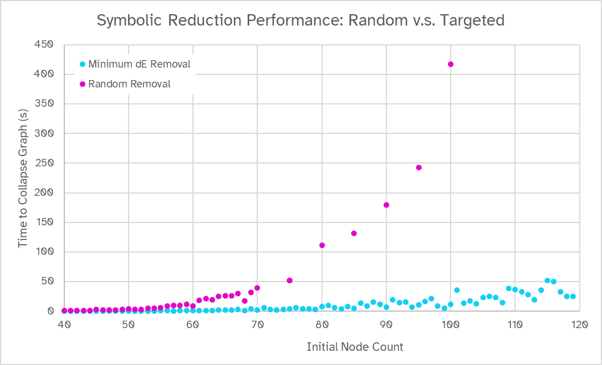

<div class="imblock">
</img>
</div>

Red lines are \\(1\Omega\\) resistors, blue lines are \\(1\textrm F\\) capacitors, and yellow lines are \\(1\textrm H\\) inductors. What's the equivalent impedance between nodes \\(A\\) and \\(B\\)?

This is a random [Watts-Strogatz graph](https://en.wikipedia.org/wiki/Watts%E2%80%93Strogatz_model) with 32 vertices, and it would be a mess to reduce by hand. Sure, you know there *is* an explicit expression for the impedance as a function of frequency \\(\omega\\), but it's huge, and you'd much rather give the circuit to a SPICE model and come back with the results of a frequency sweep.

That's fine, but there's something attractive about [symbolic circuit analysis](https://en.wikipedia.org/wiki/Symbolic_circuit_analysis), and exact, fully parameterized \\(s\\)-plane representations of filters are nice if you want to generate Bode plots and accurately identify poles and zeroes.

Okay, maybe we perform a nodal/mesh analysis and throw everything in MATLAB to resolve the system with some ordinary method (e.g. Gauss-Jordan elimination). That'll work, right?

Welcome to "how I spent my weekend".

### The Difficulty
Spoiler alert: Here's an equivalent transfer function for 2 nodes in an 8-node network of random \\(1\Omega\\) resistors, \\(1H\\) inductors, and \\(1F\\) capacitors with an average degree of 4:
\\[
\frac{3s^{10} + 26s^9 + 77s^8 + 214s^7 + 353s^6 + 470s^5 + 436s^4 + 316s^3 + 154s^2 + 48s + 6}{5s^{10} + 35s^9 + 113s^8 + 298s^7 + 517s^6 + 677s^5 + 640s^4 + 457s^3 + 222s^2 + 65s + 9}
\\]
This is still a very obnoxious expression, and it's not an easy one to find.

Transfer functions are rational functions. Any time we add two rational functions, we need to expand them, get their denominators in the same form, add them, and factor them again. If you *don't* factor them, the numbers in your expressions get ridiculously large very quickly, and all hope is lost, even for smaller (e.g. \\(N=16, E=32\\)) graphs.

Unfortunately, factoring is expensive, especially when the size of your numbers is loosely proportional to the degree of your polynomial. This ends up being the bottleneck to our solver: working with huge rational expressions can be slow.

After a lot of playing, I've found two semi-solutions:
1. **Don't simplify anything:**  We'll probably end up with an awful, many-thousand character expression with nested fractions, but we can still *use it*! We lose some elegance and convenience (readily available poles/zeroes). Evaluation may even be easier on the parser because it doesn't have to deal with absurdly-large exponents.
2. **Be structurally-aware:** If we *are* simplifying, divide-and-conquer approach will limit the amount of large expressions we have to join. Because simplifying expressions is polynomial with their length, this could significantly improve performance. Recall, circuit graphs are *sparse*. Let's use that to our advantage.

*Note: If you like, you can think of this whole process as a very convoluted graph transformation rule: we're building a mathematical syntax tree from an undirected network!*

Because we want to be structurally-aware, we'll approach the problem from a network perspective (rather than a matrix perspective), and work using adjacency lists with NetworkX. I'll build a regular, non-symbolic solver first, and then see about making it use letters.

First, though, a review of the transformations we'll use:

### The Toolkit
We'll talk in terms of generalized s-plane impedance: resistors have impedance \\(R\\), inductors \\(sL\\), and capacitors \\(1/(sC)\\). This gives us the edge contraction rule for impedances in series, which we probably won't need:
\\[
Z_\textrm{series}=\sum_i Z_i
\\]
The duplicate-edge removal rule for impedances in parallel:
\\[
Z_\textrm{parallel}=\left(\sum_i \frac{1}{Z_{i}}\right)^{-1}
\\]
And the node-removal rule — the [**star-mesh transformation**](https://en.wikipedia.org/wiki/Star-mesh_transform) (switching to edge-set notation):
\\[
Z_{\\{i,j\\}\textrm{ (equiv. through node }k)}=Z_{\\{i,k\\}}Z_{\\{j,k\\}}\sum_{n\mid\\{k, n\\}\in E} \frac{1}{Z_{\\{k,n\\}}}
\\]
Where \\(E\\) is the edges in the network, \\(k\\) is the index of the node to remove, and \\(i\neq j\\). Note that when applied, a star-mesh transformation can leave behind dangling edges that should be removed with the parallel rule.

I'll also mention that the star-mesh transform is the same thing as [**Kron reduction**](https://en.wikipedia.org/wiki/Kron_reduction), the only difference being that Kron reduction acts on a Y-parameter matrix instead of a Z-parameter matrix. Both operations are closely related to the [Schur complement](https://en.wikipedia.org/wiki/Schur_complement), a quantity that naturally appears during block Gaussian elimination, which is, at some level, what we're doing when eliminating node(s).

### Reduction
The annoying thing about the star-mesh transform is that it's (necessarily) a mess: it leaves behind a complete subgraph on the remaining nodes, meaning star-meshing at random will leave us with a near-complete graph. Let's forget out symbolic divide-and-conquer aspirations for a second and simply try to minimize edge count.

When removing a node \\(k\\) with degree \\(d\\), the change in the number of edges \\(\Delta E_k\\) after a star-mesh transform is in the range:
\\[
-d \leq \Delta E_k \leq \frac 12d(d-3)
\\]
\\(\Delta E_k\\) is greater when fewer of the targeted node's neighbors are connected to each other; the edges formed by the transform are already there. Specifically,
\\[
\Delta E_k = \frac{d(d-3)}2 - |\\{\textrm{edges connecting neighbors of node }k\\}|
\\]
To keep our graph sparse, we'd like to remove nodes with negative or small \\(\Delta E_k\\). This isn't easy to do perfectly: the number of possible reduction schemes for a graph with \\(N\\) nodes is just \\(N\\) factorial, and the availability of good moves in the future obviously depends on the move history.

But, intuitively, I expect being greedy to get us pretty far. Let's try that first.
### Code
You can see the full source [on my GitHub](https://github.com/Rachmanin0xFF/impedance-explorer); I'll only walk through the important parts:
<pre><code class="language-python">class ImpedanceNetwork:
	# Let the user define 1, 0, and s, that way we can easily work with
	# CAS libraries (as long as they have operator overrides)
	def __init__(self, one=1, zero=0, s=1):
        self.m_s = s
        self.m_1 = one
        self.m_0 = zero
	# I'll go through delta-E calculation first:
	def calc_dE(self, node_id):
	        pairs = itertools.combinations(self.G.adj[node_id], 2)
	        existing_edges = sum([(1 if self.G.has_edge(e[0], e[1]) else 0) for e in pairs])
	        d = self.G.degree[node_id]
	        dE = d*(d-3)//2 - existing_edges
	        self.G.nodes[node_id]['dE'] = dE
	        return dE
	
	# And now the star-mesh transform:
	def remove_node(self, node_id, simplification_method=(lambda x : x)):
	        connected_edges = self.G.adj[node_id]
	
	        # Find summed inverse impedances to target node (reusable quantity)
	        z_inv = self.m_0
	        for i in connected_edges:
	            z_inv += self.m_1 / connected_edges[i]['expression']
	
	        # Look through all pairs of neighboring nodes
	        for comb in itertools.combinations(connected_edges, 2):
	            expr1 = connected_edges[comb[0]]['expression']
	            expr2 = connected_edges[comb[1]]['expression']
	            # Compute the equivalent resistance through the targeted node
	            prod = simplification_method(expr1 * expr2 * z_inv)
	
	            if self.G.has_edge(comb[0], comb[1]):
	                # If there's already an edge where we want to put one, merge our new
	                # edge with it using the impedances-in-parallel rule.
	                self.G.edges[comb]['expression'] = simplification_method(self.m_1 / (self.m_1 / prod + self.m_1 / self.G.edges[comb]['expression']))
	            else:
	                self.G.add_edge(comb[0], comb[1], expression=prod)
	        self.G.remove_node(node_id)
</code></pre>
The class is CAS-agnostic and can be used with anything with a Python binding. I settled on [Symbolica](https://symbolica.io/), which outperforms the alternative [SymPy](https://www.sympy.org/en/index.html) by over a thousand times (yes, that many — this is from profiling). The results check out against [Falstad's simulator](https://www.falstad.com/circuit/), but how elegantly does our greedy method perform?

First, I'll show the reduction applied to the largest component of a Erdős–Rényi graph (\\(N=100, p=2.5/(N-1)\\)):
<div class="imblock">
</img>
</div>

You can see that the algorithm starts by removing the 'easy' leaf nodes and isolated cycles. The network grows denser until it reaches full connectedness at \\(n=5\\).

Let's convince ourselves that this approach is better than removing nodes at random. We'll count the number of edges (more edges = more number-crunching) on some denser Watts-Strogatz graphs (they don't have any 'freebie' nodes).
<div class="imblock">
</img>
</div>

This looks good! Random removal reaches the complete graph limit (shown in gray) very quickly, while greedily minimizing \\(\Delta E\\) manages to keep the graph complexity down. However, this is not a guarantee, and for larger, more dense networks, the 'bump' at the end of the simplification grows. This is a question of 'how long can I delay the inevitable \\(N(N-1)/2\\)', and I suspect that improvements on this strategy will only find marginal gains. Additionally, *relative* performance increases with initial graph size because the 'random removal' hump grows even faster.

*Note: as soon as the graph is near-complete, there's probably no downside to throwing it into a conventional solver. I don't do that here, though.*

Good enough for now. Let's start throwing letters around.
### Symbolic Expressions
Symbolica has a class specifically designed for handling rational expressions, and it automatically simplifies when adding / multiplying. Getting `ImpedanceNetwork` to use symbols is as easy as:
<pre><code class="language-python">symbolic_net=ImpedanceNetwork(
    symbolica.N(1).to_rational_polynomial(),
    symbolica.N(0).to_rational_polynomial(),
    symbolica.S("s").to_rational_polynomial())
</code></pre>
Alright! How much does this kill our performance? Here's the simplification time on three Watts-Strogatz (\\(m=4, p=0.2\\)) graphs, with the initial edge transfer functions randomly selected from \\(\\{1, s, 1/s\\}\\) (resistors, inductors, and capacitors):
<div class="imblock">
</img>
</div>

Uh-oh. This trend slows down a little, but it's still bad (y-axis is log-scaled):
<div class="imblock">
</img>
</div>

Of course, these figures are *very* dependent on the graph's structure. But the trend seems unlikely to change unless we're looking at a dead-simple graph.

To be fair, we are able to compute transfer functions for 50-node networks where the final numerator and denominator are both dense, high-degree polynomials with terms like \\(51702905702907591023s^{49}\\). And we can do it in less than a second in Python. But is there still room for improvement?
### Tweaks?
There's no getting around the factorization bottleneck. Symbolica's performance is fantastic, but my profiling says it's still \\(O(n^2m^2)\\), where \\(m\\) is the degree of the input polynomials and \\(m\\) is the number of digits in their factors. Unfortunately for us, both \\(n\\) and \\(m\\) grow rapidly as our network shrinks. What if we try to minimize expression length while simplifying? Maybe there are still optimizations to be made?

I wrestled with this for a while, and I think the answer is 'no'. Greedily minimizing \\(\Delta E\\) seems to implicitly minimize expression complexity, as well. Here are some of the ways I've tried costing nodes:
1. By the estimated complexity of the operations performed when removing them
2. By the estimated total growth of expression length during removal
3. By a new edge attribute that accumulates merge operations

Sadly, none of these options were able to boost performance more than ~10%. If I make any headway here, I'll update this article, but for now, it seems like we're up against the wall. Nonetheless, it's important to remember that we're already beating 'random node removal' by a significant margin:
<div class="imblock">
</img>
</div>

### The Network
I started this post with a messy network and asked for the equivalent impedance between two of its nodes in symbolic form. Here's the answer, computed in 0.34 seconds:
```
F(s) = 
(13024+423864*s+6290968*s^2+59905770*s^3+419971466*s^4+2328553795*s^5+10666246281*s^6+41544905354*s^7+140418256651*s^8+418021132839*s^9+1108513262253*s^10+2641458239448*s^11+5694944169448*s^12+11169842737682*s^13+20017347113742*s^14+32890704323665*s^15+49686127771723*s^16+69153171278024*s^17+88815841328572*s^18+105377662110673*s^19+115577795585479*s^20+117213265070870*s^21+109898401825003*s^22+95209955044713*s^23+76144592397270*s^24+56139460758443*s^25+38087358599841*s^26+23723166358160*s^27+13526848059304*s^28+7035984639405*s^29+3324270611505*s^30+1419201938017*s^31+543994224123*s^32+185746782561*s^33+55942180068*s^34+14675395770*s^35+3298811918*s^36+621567139*s^37+95200699*s^38+11328462*s^39+974622*s^40+53228*s^41+1356*s^42)
/
(21696+621808*s+8424704*s^2+75189300*s^3+501317064*s^4+2669913242*s^5+11827889794*s^6+44778896020*s^7+147660007455*s^8+430093449201*s^9+1118378802152*s^10+2617704342316*s^11+5551059650842*s^12+10720002858287*s^13+18930620635150*s^14+30669593192397*s^15+45702950778767*s^16+62767664433044*s^17+79564728419931*s^18+93182290462775*s^19+100884227367702*s^20+100986346149594*s^21+93444195711313*s^22+79877020212758*s^23+63012336526151*s^24+45807229399339*s^25+30628095477795*s^26+18790504530192*s^27+10546255544103*s^28+5395400097289*s^29+2504959039272*s^30+1049793305386*s^31+394542349634*s^32+131907886830*s^33+38838709831*s^34+9943046344*s^35+2176742910*s^36+398516178*s^37+59150934*s^38+6801540*s^39+563860*s^40+29624*s^41+728*s^42)
```
And here's the magnitude of that, plotted along the imaginary axis (using Symbolica's `evaluate_complex()`):
<div class="imblock">
</img>
</div>

Mission accomplished!