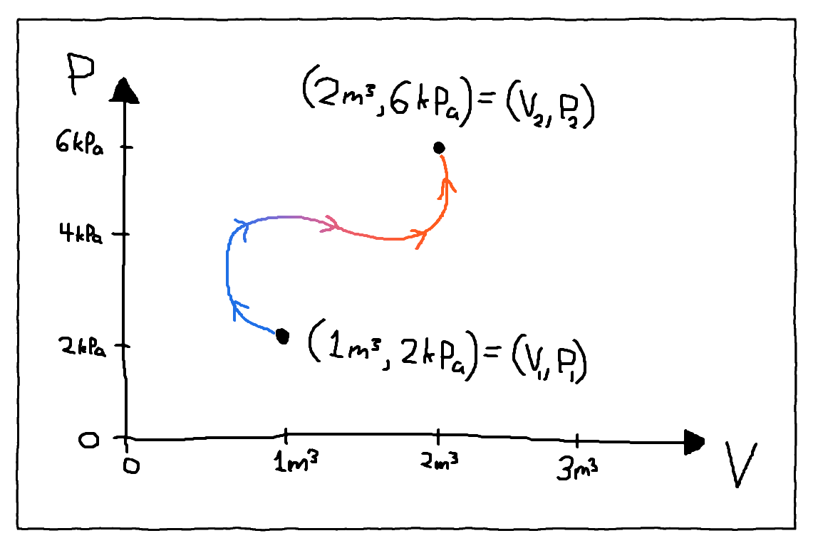
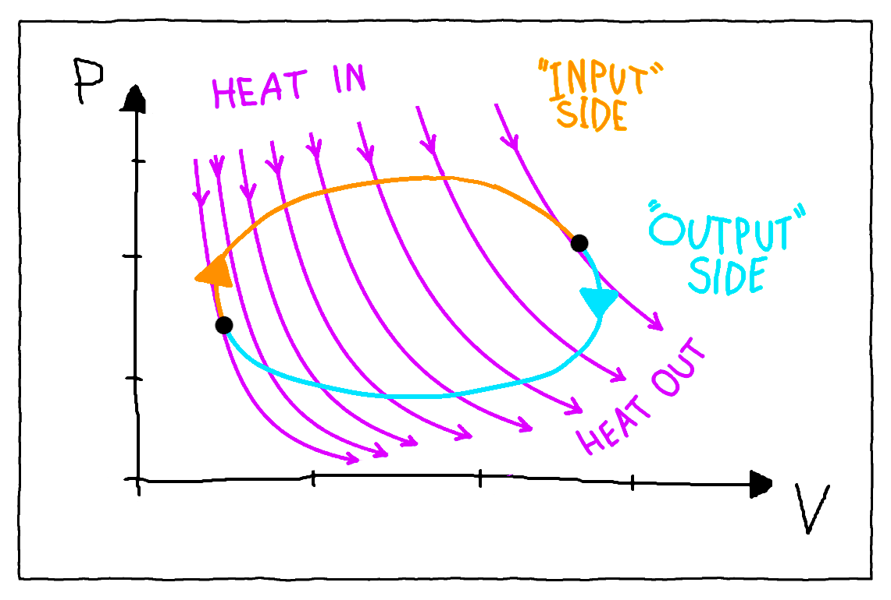
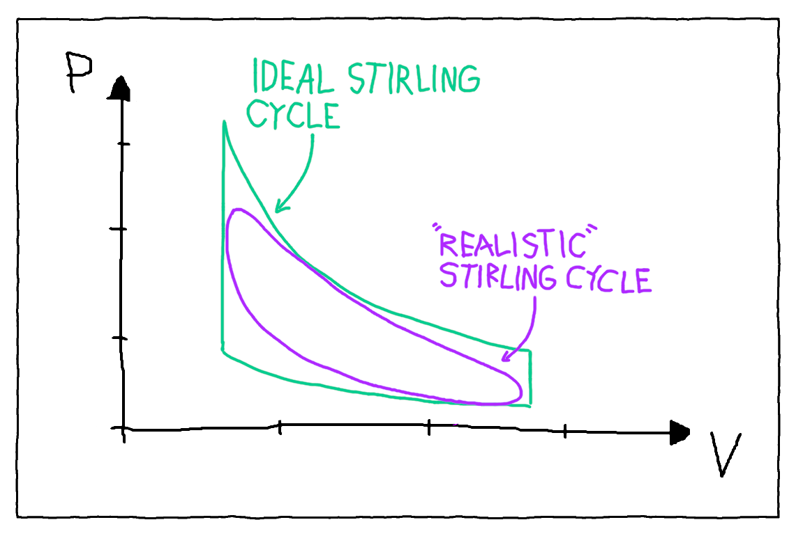

## Introduction

A month or two into my introductory thermodynamics course, our professor told us to "create your own thermodynamic cycle and find its efficiency". I don't know what compelled me, but I drew a circle on my PV diagram:

It looked like this.

I then realized I hadn't been equipped to find the efficiency of this frustratingly simple shape. Undergraduate thermodynamics only discusses a few types of processes: isobaric, isochoric, isothermal, adiabatic, and isentropic. And that's good enough for most practical purposes! It's hard to design a mechanism that *doesn't* approximately realize one of those sorts of paths.

But I went ahead and did it anyway, and it ended up feeling educational. At any rate, it's a cute problem!

## The Pressure-Volume (P-V) Plane

If a system is in thermodynamic equilibrium (it has homogeneous macroscale thermal properties), we can talk about its pressure (P) and volume (V). These two state variables are not always sufficient to describe a system, but they are *useful* to consider because they are closely related to **mechanical work**. This is evident with some dimensional analysis:

$$ [\textrm{Pressure}][\textrm{Volume}]=\left(\frac{\textrm{Newtons}}{\textrm{m}^2}\right)\left(\textrm{m}^3\right) = (\textrm{Newton})(\textrm{m}) = \textrm{Joule} = [\textrm{Work}] $$

The equivalence above is fairly intuitive; if we compress some gas with constant pressure $ P $ by some amount $ \Delta V $, we must be doing some work $ W=P\Delta V $ on it. However, most of the time, changing a system's volume will also change its pressure, and the relationship between P and V is dependent on the **heat** allowed to flow in or out of the system. To visualize this, we make a parametric plot in P and V of the system as it changes over time:

An example PV diagram of an arbitrary thermodynamic process.

No practical system/engine is always in thermal equilibrium, and every little part of the system may take a different path (in the PV plane) to its destination. However, the quasi-static (slow-moving) processes that we can draw on the plane are still decent approximations of real systems. The most useful property of these diagrams is that they provide a visual representation of the work done by a process. Recall that $ \Delta W = P\Delta V $ (under constant pressure). We can rewrite this in its differential form:
$$ dW = P\ dV $$

And then integrate (the minus is just a sign convention):

$$ W = -\int P\ dV $$

In other words, the work done by a process is the negative signed area under the process in the PV plane. Consequently, if our process is a cycle (it ends where it begins), then the work done by the process is the **signed area enclosed by the cycle in the PV plane**. I think this easy result is why PV diagrams are often preferred over diagrams using some other two state variables (e.g. TS diagrams).

## Heat

The first law of thermodynamics states that the change in the total internal energy of a system must be equal to the work done on the system plus the heat gained by the system. Rearranging things in differential form, we find:

$$ dU = \delta Q - P\ dV \implies \delta Q = dU + P\ dV $$

Where $ U $ is the total internal energy of the system and $ Q $ is the heat added to the system. Unfortunately, at this point, we need to settle on an equation of state. Without an expression for the total internal energy of our system, we are unable to determine the heat it is receiving or rejecting. Remember, we're trying to find the efficiency of an arbitrary path through PV space, so we need to write U in terms of P and V. I'll keep it simple and use the [ideal gas law](https://en.wikipedia.org/wiki/Ideal_gas_law#Common_forms):

$$ \delta Q = d\left(\frac{f}{2}PV\right) + P\ dV $$

Where $ f $ is the number of degrees of freedom of the gas molecules (3 for a monoatomic gas). We can expand this with the product rule:

$$ \delta Q = \frac{f}{2}(P\ dV + V\ dP) + P\ dV $$

Recalling that $ \gamma = (f+2)/f $ is the definition of the [adiabatic index](https://en.wikipedia.org/wiki/Heat_capacity_ratio) for an ideal gas:

$$ \delta Q = \frac{f}{2}(\gamma P\ dV + V\ dP) $$

Now we assume our path can be parameterized by some variable $ \theta $, $ P=P(\theta) $, $ V=V(\theta) $, and we integrate to find $ Q $:

$$ Q = \frac{f}{2}\int \left[\gamma P(\theta')\frac{dV}{d\theta}\Big|\_{\theta'} + V(\theta')\frac{dP}{d\theta}\Big|_{\theta'}\right] d\theta' $$

Cool! Now we have an integral that can be evaluated (numerically, if we like) to find the heat required by any thermodynamic process.

## Hot Hot Circle

Let's parameterize and integrate our circle. Actually, our axes have arbitrary, independent units, so let's make it an axis-aligned ellipse:

$$ \begin{pmatrix} P(\theta) \\\\ V(\theta) \end{pmatrix} = \begin{pmatrix} P_0 - b\sin\theta \\\\ V_0 + a\cos\theta \end{pmatrix} $$

And our derivatives are:

$$ \begin{pmatrix} dP/d\theta \\\\ dV/d\theta \end{pmatrix} = \begin{pmatrix} -b\cos\theta \\\\ -a\sin\theta \end{pmatrix} $$

Plugging this into our integral, we get:

$$ Q=\frac{f}{2}\int_{\theta_1}^{\theta_2} \left[ \gamma (P_0 - b \sin \theta) (-a \sin\theta) + (V_0 + a \cos\theta) (-b \cos \theta) \right] d \theta $$

I won't write out the closed form; the integral is simple and the result isn't very enlightening. However, I will note that if $ \theta_1 = \theta_2 \pm 2\pi $, the integral evaluates to $ Q = \pi a b $: the area of the ellipse (yes, Green's theorem is hidden in here)! This is actually exactly what we expect; in a thermodynamic cycle, the internal energy change of the system after a complete cycle must be zero (it ends where it begins). So from the first law, $ Q = -W = \textrm{area enclosed by cycle} $.

## Efficiency

Let's define efficiency (for an engine):

$$ \eta = \left|\frac{W}{Q_{in}}\right| $$

You can read this as "the amount of work you get out when you put a unit of heat in". It's a clean, universal definition, and we already have $ W = -\pi a b $. However, Finding $ Q_{in} $ is not so simple.

The magenta lines in this diagram are adiabatic: processes with no heat exchange involved. Running against the grain of these lines means our process must be transferring heat to or from an external source.

Heat flows into our system wherever the differential element of heat for that section of the path is positive. At points where heat is neither flowing in or out, $ \delta Q = 0 $, and our path must be tangent to an *adiabatic* (no heat exchange) curve on the plane. If we can find these stationary points on our ellipse, we can determine where to begin and end our integral for $ Q_{in} $. For an ideal gas, the [family of adiabatic curves](https://en.wikipedia.org/wiki/Isentropic_process#Derivation_of_the_isentropic_relations) is given by $ PV^\gamma=C,\ C>0 $. Additionally, we can rewrite our elliptic curve as an implicit equation:

$$ \frac{(P-P_0)^2}{b^2}+\frac{(V-V_0)^2}{a^2}=1 $$

To find where this curve is tangent to an adiabatic process, we can use implicit differentiation on this formula:

$$ \frac{dP}{dV}=-\frac{b^2}{a^2}\left(\frac{V-V_0}{P-P_0}\right) $$

And on $ PV^\gamma=C $:

$$ \frac{dP}{dV}=-\frac{\gamma P}{V} $$

Equating the two,

$$ \frac{b^2}{a^2}\left(\frac{V-V_0}{P-P_0}\right)=\frac{\gamma P}{V} \implies b^2V(V-V_0)=a^2\gamma P(P-P_0) $$

This equation defines a hyperbola, but we still need to determine where it intersects with our ellipse. Finding the intersection of two conic sections is a [messy problem](https://math.stackexchange.com/questions/1767225/algorithm-intersection-of-two-conics) that can be solved via Lagrange multipliers. Ultimately, we expect our solution to be the roots of some univariate polynomial. I handed the problem over to maple [Maple](https://www.maplesoft.com/products/Maple/), which gave me this:

$$ \begin{align} P_{dQ=0} &= \textrm{Roots}\left[f(y)\right],\ f(y)=\sum_{n=0}^4 c_n y^n \\\\ c_4 &= a^2\gamma ^{2}+2a^2\gamma +a^2\\\\ c_3 &= -2a^2P_{0}\gamma ^{2}-6a^2P_{0}\gamma -4a^2P_{0}\\\\ c_2 &= a^2P_{0}^{2}\gamma ^{2}+6a^2P_{0}^{2}\gamma -2a^2b^2\gamma +6a^2P_{0}^{2}+b^2V_{0}^{2}-2a^2b^2\\\\ c_1 &= -2a^2P_{0}^{3}\gamma +2a^2b^2P_{0}\gamma -4a^2P_{0}^{3}-2b^2P_{0}V_{0}^{2}+4a^2b^2P_{0}\\\\ c_0 &= a^2P_{0}^{4}+b^2P_{0}^{2}V_{0}^{2}-2a^2b^2P_{0}^{2}-b^4V_{0}^{2}+a^2b^4 \end{align} $$

I've checked this (numerically); its complexity is an indication that what we're doing here is somewhat unphysical — more on that later. Once we've found the root of the quartic polynomial above, we can retrieve the necessary 'angles' for our integral for $ Q_{in} $:

$$ \theta=\textrm{atan2}\left(\frac{-(P-P_0)}{b},\frac{V-V_0}{a}\right) $$

Interestingly, there are actually conditions in which the sign of $ dQ/d\theta $ changes *four* times (we are dealing with a quartic, after all), but these only happen when the cycle is very close to one of the axes.

## Example

We choose $ P_0=2 $, $ V_0=3 $, $ a=2 $, $ b=1 $, $ f=3\implies \gamma=\frac{5}{3} $, and $ n=R=1 $. Then our roots are:

$$ \begin{align} P_{dQ=0}&=\textrm{Roots}\left[ \frac{256}{9}y^4-\frac{1408}{9}y^3 + \frac{2593}{9}y^2 - 212y + 63 \right] = \\{1.8342, 2.4950\\} \\\\ \implies (\theta_1, \theta_2) &= (2.9750\ \textrm{rad}, 5.7654\ \textrm{rad}) \end{align} $$

Using these values, we determine:

$$ \begin{align} Q_{in}&=\int_{\theta_1}^{\theta_2} \left[\frac{5}{3}(2-\sin\theta)(-2\sin\theta)+(3+2\cos\theta)(-\cos\theta)\right] dt = 25.381 \\\\ W&=-2\pi=-6.2832 \\\\ \eta &= \left|\frac{W}{Q_{in}}\right|=0.24756 \end{align} $$

So the efficiency of this elliptical cycle is about 25%! For reference, the Carnot efficiency of this cycle is roughly 85%.

## In the Real World

There isn't much we can do with an ideal gas. Our options are:
1. Compress or expand it (with perfect or no insulation)
2. Heat it up or cool it down (with fixed volume or pressure)
3. Some combination of 1 and 2

1 and 2 contain all of the 'classic' quasistatic processes you'll see in a textbook (isothermal, adiabatic, etc.). However, they are practically impossible to do in the real world. Real processes (e.g. those in actual engines) can only be accurately described by 3. Additionally, faster processes are (typically) less quasi-static, and it is difficult to justify approximating them with a single line on a PV diagram.

This is why introductory thermodynamics classes only concern themselves with those few traditional processes: if your path isn't one of them, you're probably not dealing with a quasi-static system. However, we can still put sensors in an engine and *make* PV diagrams using the resulting data. And actually, these diagrams tend to resemble elliptical blobs more than their angular, ideal counterparts.

Real cycles have curves!

Practically, you can expect these diagrams are analyzed with numeric methods, and that efficiencies can be calculated directly from fuel intake and power output. But it's still fun to consider the analytical side of things occasionally!