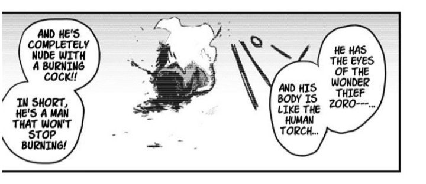
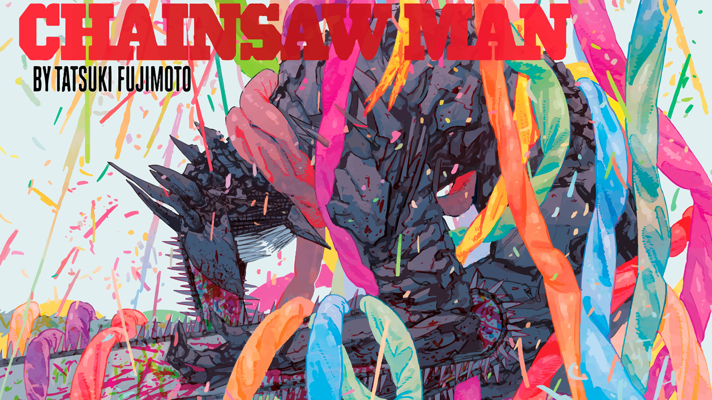
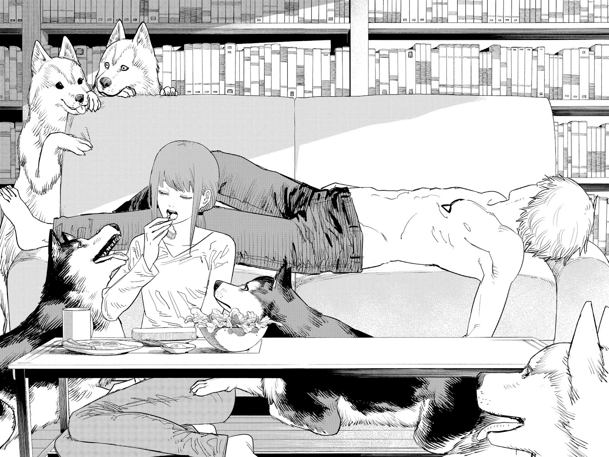
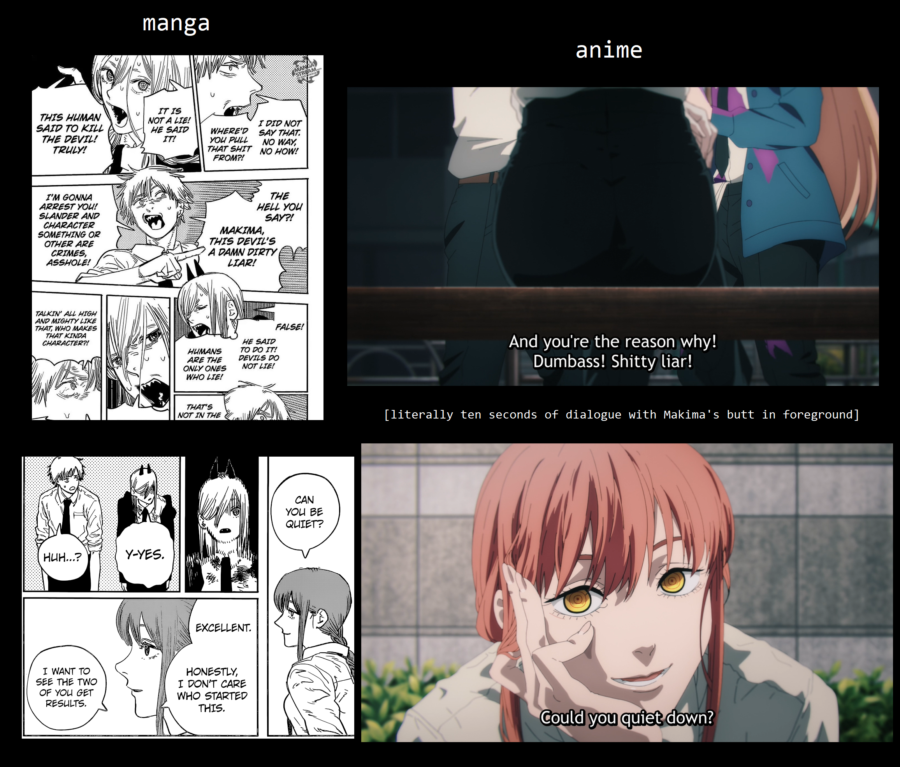
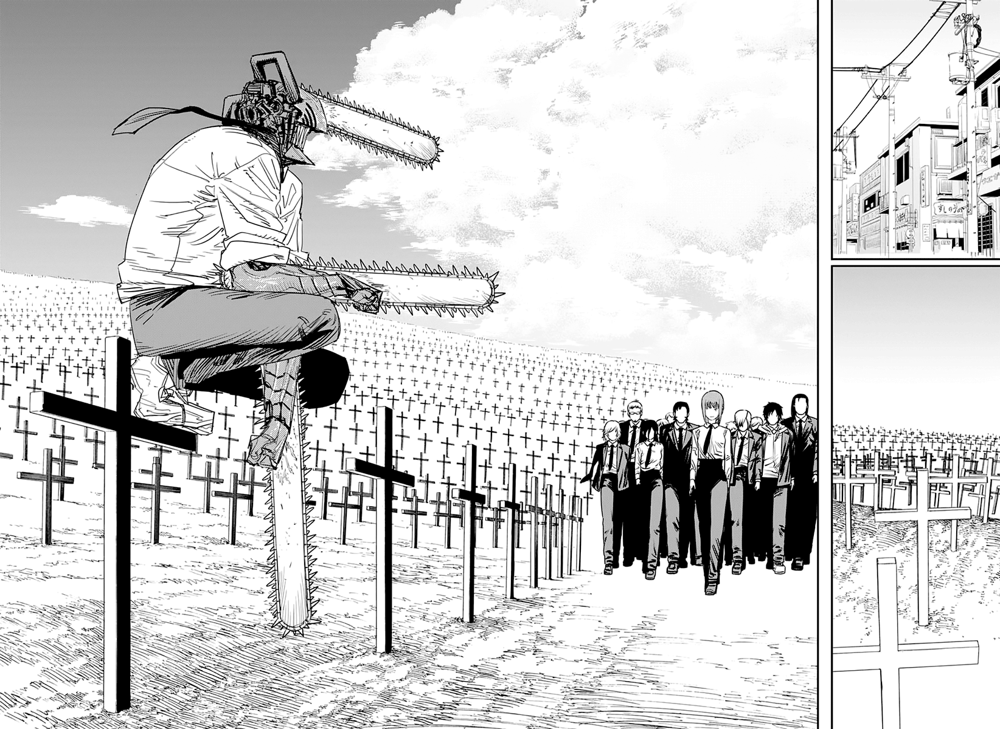

This is a late-night rant I wrote in a private discord server ~3 years ago. I'm not a fan of the writing, and the structure is sort of strange, but I think the substance is good. It will live here for now; maybe I'll create a rewrite / sequel eventually.

## Anime channel archive

Rachmanin0xFF — 11/20/22, 3:00 AM

Okay, I have some more stuff to say about Chainsaw Man. I will start with Japan.

### Japan
Japan boasts a 98% Japanese racial demographic, it has no human rights institutions, and it has no laws against discrimination based on race, gender, sexuality, or religion (yes, really). Japan’s strict conformity and traditionalism makes social and organizational change very difficult, so in some areas it lags behind other first-world countries.

Unfortunately, one of these areas is the treatment of women. Birth control wasn’t legalized in Japan until 1999, women hold just roughly 10% of positions in Japanese government, and groping on Japanese subways is such a problem that Japan still runs female-only passenger cars. In the rare cases where a sexual assault victim decides to break societal norms and go to the police, they are often unwilling to hear out the case. 
However, none of this anachronism fully explains the weirdness of sex appeal in anime and manga.

### Giant Anime Boobies

I hate this shit. If you've been on the Internet, you know what I mean. Recurring, obnoxious sexualization of female characters pervades nearly every sub-mainstream anime or manga published to international markets. Accidental groping, characters walking in on each other bathing, and animation budgets burned on making sure every girl’s breasts bounce whenever they move (*the exceptions are usually manga written by women – here are some of my favorite female authors: Kamome Shirahama, Hiromu Arakawa, Yoshitoki Ōima, and Ryoko Kui*). To make matters worse, the characters are almost always under 18.

There’s a reason that so many popular series have this stuff (One Piece, MHA, Naruto): they all began as manga published in Weekly Shōnen Jump (WSJ). WSJ is the titan of shōnen (“boy’s”) manga. It hosts roughly twenty different series at any given time, and it is a notoriously competitive publication. If a new series in WSJ doesn’t do well in the magazine’s popularity polls, it gets axed. This happens very often, even to pretty lengthy series, so mangaka (manga creators) are under constant pressure to comply with the requests of WSJ’s editors or lose their job.
…and, often, those requests amount to “add more sexy stuff”. Like, literally, “show the girl’s panties in this panel”. Why? Because it sells well to the horny teenagers that buy these magazines.

### Fujimoto

A panel from Fire Punch

Tatsuki Fujimoto wrote *Chainsaw Man*. He is a very eccentric author. He was recently banned from Twitter for impersonating his imaginary 14-year-old little sister, he allegedly ate his pet goldfish when it died, and I’ve posted the video of him trying to levitate in this channel before. His first serialized manga was *Fire Punch*. It is about a man who is constantly on fire (and usually naked). The first chapter features cannibalism, incest, and immolation. The series begins as a simple revenge story with some quirky elements, but quickly digresses into a wild, existential tragedy. Fujimoto’s work is comedically absurd, introspective, and heavily influenced by film. His paneling is distinctly cinematic, his writing is dry and abrasive, and his art lacks all the cuteness that popular manga usually has.

*Fire Punch* was published in WSJ Plus, a side publication run by WSJ that features more experimental stories. People had a hard time figuring out what the hell the manga even *was*: many people called Fujimoto a genius, many others thought the whole work was idiotic. I lean towards the former.

### Chainsaw Man

Manga published in WSJ is full of idiosyncrasies: male protagonists, frequent fight scenes, a large cast of attractive female love interests, and characters showcasing their raw determination and human spirit. In an interview, Fujimoto said he had always wanted to make a “Jump-like” manga, and *Chainsaw Man* realized that desire.

When it came out, manga readers were surprised that it made the cut. The gore and violence in the first chapter were far beyond typical WSJ levels, and the protagonist’s ambitions were ignoble in comparison to the smiling heroes of other series: Denji’s goals were to eat good food, live a normal life, and get laid before he died.

Nonetheless, *Chainsaw Man* had all the necessary WSJ elements, and its bombastic nature propelled it up the rankings, earning Fujimoto’s security and one of the most ambitious anime adaptations in recent history.

### The Anime
*Chainsaw Man* (CSM) is probably the highest-profile anime production since *One Punch Man*. The studio, MAPPA, managed to acquire a dream team of action animators and other talent. I won’t drop names but believe me when I say they are some of the best.

Actually, I will mention Ryu Nakayama, the director of the series. He was probably the perfect choice for this adaptation; Nakayama was a long-time fan of Fujimoto’s work, and both he and the author are film buffs. Nakayama has stressed that he is trying to direct CSM like a film, not an anime, and that intent carries through to the final product. Although the “filmic” CSM adaptation lacks Fujimoto’s rough, comedic absurdness, it feels like it might be closer to what Fujimoto would want to make if he were allowed to direct an anime.

### Fujimoto and Sex

*Fire Punch* featured a non-sexualized transgender character. It fit the setting and storyline perfectly, and their identity never felt exploited for the sake of the manga. When Fujimoto includes LGBTQ+ characters in his work, their inclusion feels casual, regular, just a regular staple of life – like it should. I cannot emphasize enough how rare this is. Sure, there are some excellent manga *about* gender identity and sexual orientation, but it is extremely challenging to find manga about *other things* that includes LGBTQ+ characters.

A panel from Chainsaw Man

There isn’t as much of this in *Chainsaw Man*, but what I’m really getting at here is that Fujimoto is a progressive dude that doesn't subscribe to the typical shonen mangaka sex-slop factory standards. Yes, his characters are frequently naked (both in CSM and *Fire Punch*), but it's never *attractive*. His depictions of nudity are flat, primitive, and extremely un-sexy, like an afterthought of human anatomy. And his depictions of sexual contact are grossly mechanical and depicted on the same level as any other human bodily function (eating, urination, etc.)

### Sex in Chainsaw Man 
So, how does Fujimoto reconcile his non-sexy style with WSJ’s demand for giant breasts?

Denji – the protagonist of CSM – is fueled by pure hedonism. He wants to eat, he wants to sleep, and he wants to have sex. This gives Fujimoto the ability to create the sexual situations that WSJ demands.

The joke of Chainsaw Man is that every time Denji gets into a sexy situation, it’s a total let-down. His first real goal in the story is to feel some tits. He quickly achieves this (with the girl’s consent), and his reaction is “that’s it?” Next, a girl kisses him for the first time, but she vomits in his mouth during the kiss. His tongue gets bitten off during his second kiss. Much later in the story, Denji takes a bath with a female character suffering from PTSD, but he gets absolutely nothing out of the experience because he’s grown to see her as a sister.

Ultimately, the manga features a sporadic series of sexual situations that make Denji question his own hedonistic goals. It ends up being pretty depressing, actually!

### My Problem With the Anime
In the third episode of the anime (ch. 5 in the manga), this happened:

…I hate this *so much*.

There is *no good reason* to hide 10 seconds of frenetic characterization behind another character’s ass. In the manga, Fujimoto sexualizes Makima’s character maybe two or three times, and each time there is a narrative impetus for that sexualization. But this? It is nothing but ooga booga booty booty booty. I get why MAPPA did it; it sells well to horny anime viewers that can’t stay invested for more than two episodes unless they see a girl being sexy. But man, I really wish the industry would stop catering to these sorts of fans.

Also, this isn’t an isolated incident. The show seems to really take its time with any sexual scenes involving a female character. For example: oh, the manga has a kissing scene? *Let’s embellish it with a shot of the characters’ tongues flicking around.* Or: oh, a girl hugs the main character? *Let’s throw in an anime-original cut of her boobs compressing against the guy’s arm.* Sexy scenes in the manga that felt just a few seconds long are drawn out into minutes of unnecessarily fluid animation.

I abhor this kind of thing in anime, and I’m disappointed that it made its way into *Chainsaw Man*.

### The Good

<video autoplay muted loop>
  <source src="csmed.mp4" type="video/mp4">
  Your browser does not support the video tag.
</video>

The [article on *Sakuga Blog* I posted](https://blog.sakugabooru.com/2022/10/31/the-two-chainsaw-mans-csm-production-notes-01-03/) says much more about this, but as I mentioned earlier, Nakayama has opted to direct CSM less like an anime and more like a live-action production. That means no chibi faces, no usage of anime’s “visual language” (nosebleeds, “angry” symbols, etc.), no use of expressive limited animation, and hiring fresh talent to voice act so that the characters don’t sound too “anime”.

And wow, does it work. Its visual identity is amazing and totally unique; I have never seen anything like it. Every single movement is meticulously animated to an incredible degree for a TV anime, the ludicrous action sequences hit even harder than they would normally, and the sound design, lighting, and cinematography make the world feel completely tangible. MAPPA is only able to pull it off because they have some of the most qualified animators in the world working on this project. In the audio world, characters rarely feel overacted (still too many "anime noises" for my taste, though), and the production is scored by Kensuke Ushio, who did the soundtracks for *A Silent Voice* and *Devilman Crybaby*, to name a few.

Besides the obnoxious issue I’ve mentioned, *Chainsaw Man*’s anime adaptation is stellar. It is a wonderful fate for Fujimoto’s insane manga; and it’s looking like this quality will probably hold up for the rest of the season. Of course, considering how the manga progresses, *Chainsaw Man* won’t *really* start to shine until season two airs (please). But the quality of this adaptation is probably enough to merit the first season of CSM anime-of-the-year status. I recommend it!

Though I recommend the manga more :-)